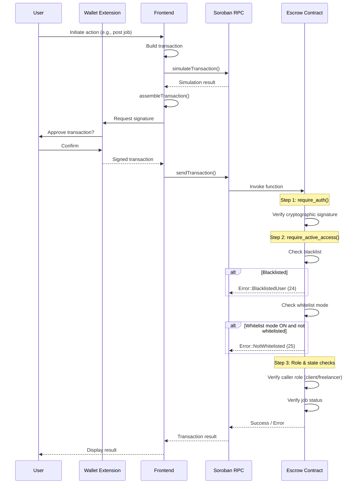
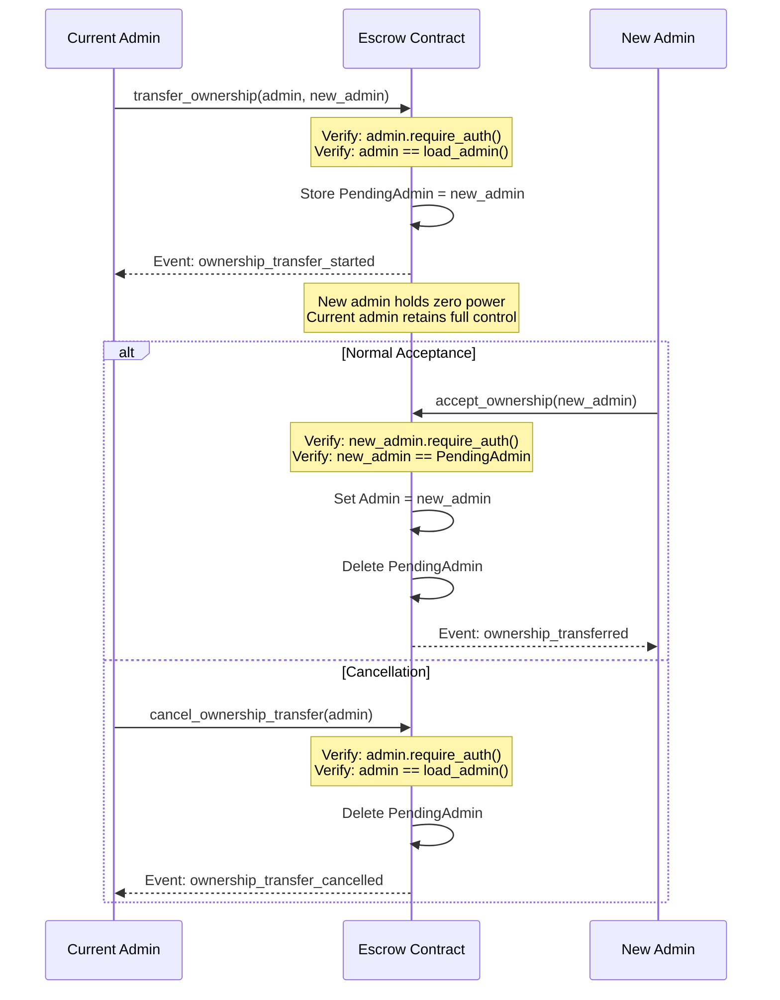
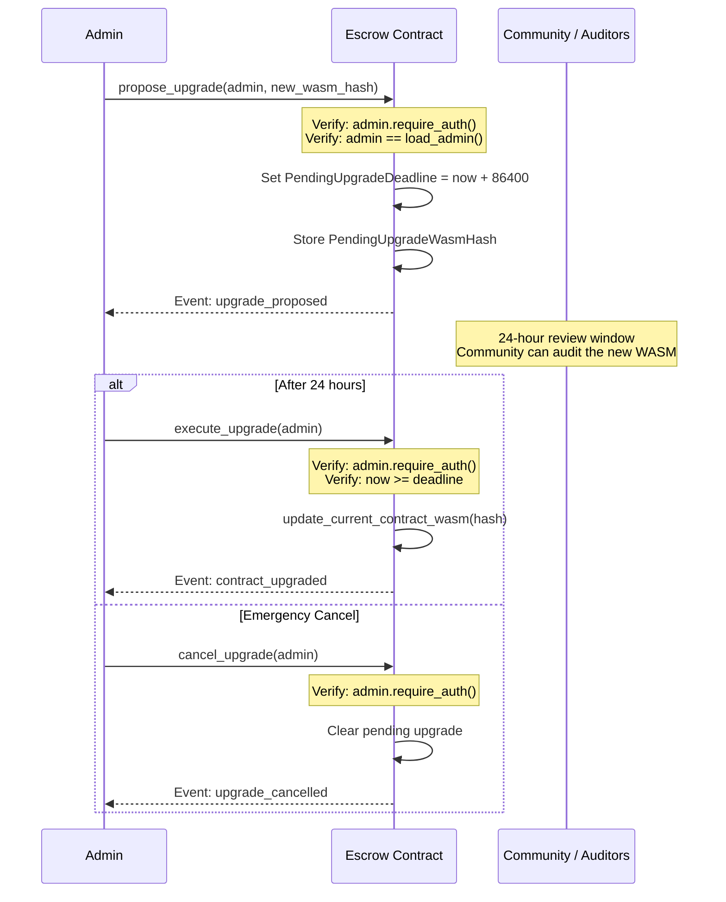
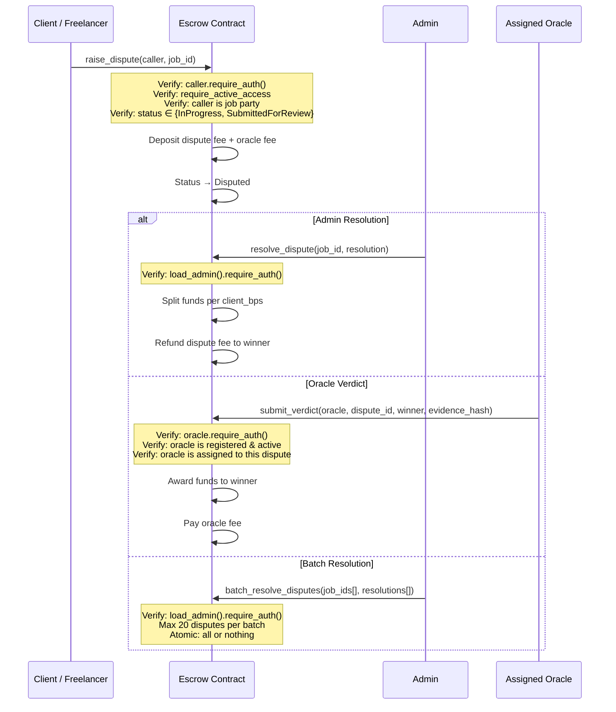
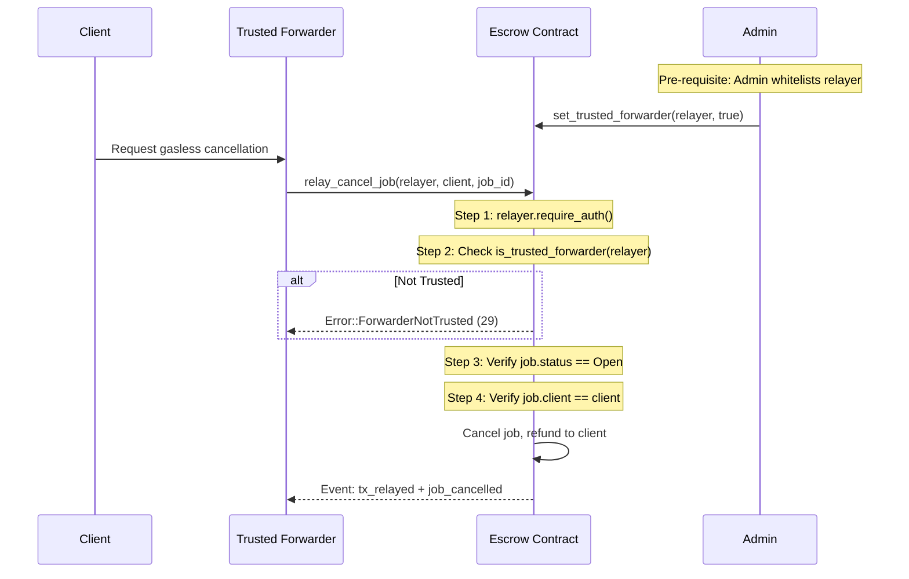
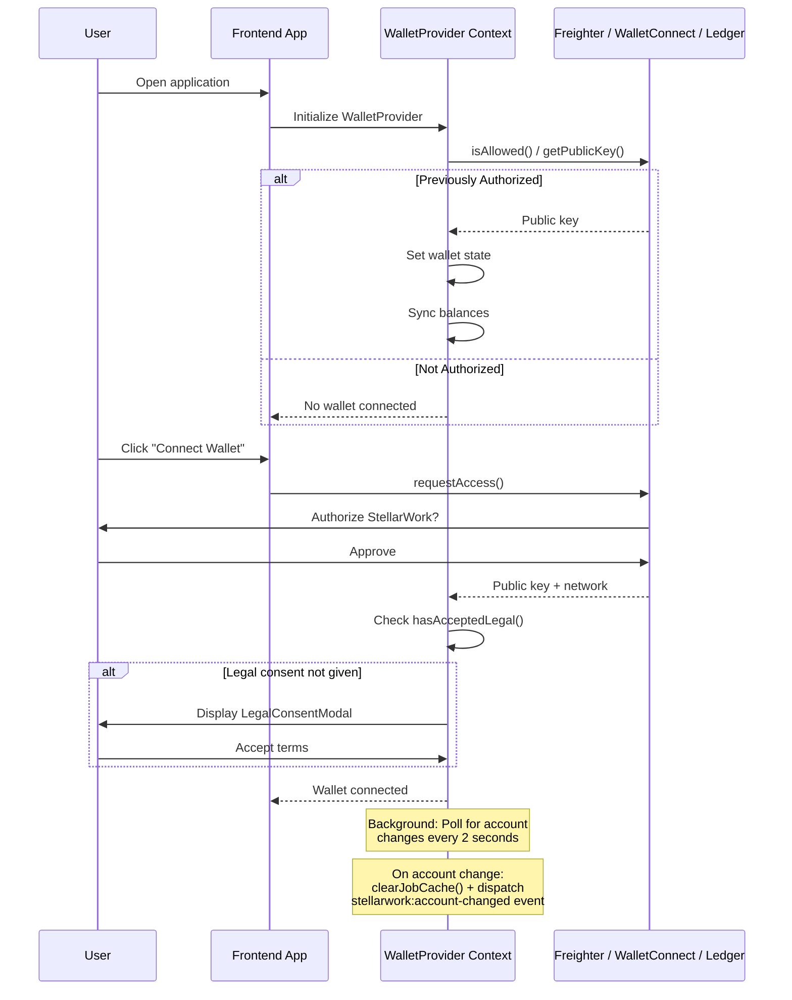

# Access Control & Authorization Documentation

> Comprehensive reference for all access control requirements, authorization flows,
> and security considerations in the StellarWork escrow and retainer contracts.

---

## Table of Contents

- [1. Roles & Permissions Overview](#1-roles--permissions-overview)
- [2. Authorization Mechanisms](#2-authorization-mechanisms)
- [3. Escrow Contract — Function Authorization Matrix](#3-escrow-contract--function-authorization-matrix)
  - [3.1 Job Lifecycle Functions](#31-job-lifecycle-functions)
  - [3.2 Dispute & Oracle Functions](#32-dispute--oracle-functions)
  - [3.3 Admin Governance & Upgrade Functions](#33-admin-governance--upgrade-functions)
  - [3.4 Access Control Management Functions](#34-access-control-management-functions)
  - [3.5 Financial Configuration Functions](#35-financial-configuration-functions)
  - [3.6 Auxiliary Authenticated Functions](#36-auxiliary-authenticated-functions)
  - [3.7 Public Query Functions (No Auth)](#37-public-query-functions-no-auth)
- [4. Retainer Contract — Function Authorization Matrix](#4-retainer-contract--function-authorization-matrix)
- [5. Authorization Flow Diagrams](#5-authorization-flow-diagrams)
  - [5.1 Standard User Action Flow](#51-standard-user-action-flow)
  - [5.2 Two-Step Admin Ownership Transfer](#52-two-step-admin-ownership-transfer)
  - [5.3 Timelocked Contract Upgrade](#53-timelocked-contract-upgrade)
  - [5.4 Dispute Resolution Flow](#54-dispute-resolution-flow)
  - [5.5 Gasless Meta-Transaction (Relay) Flow](#55-gasless-meta-transaction-relay-flow)
  - [5.6 Frontend Wallet Authentication Flow](#56-frontend-wallet-authentication-flow)
- [6. Authorization Failure Scenarios](#6-authorization-failure-scenarios)
- [7. Security Considerations](#7-security-considerations)
- [8. Access Control Testing Checklist](#8-access-control-testing-checklist)

---

## 1. Roles & Permissions Overview

The StellarWork platform defines the following roles and permission flags. Every
state-changing contract call is gated by at least one of these.

| Role / Flag | How Assigned | Key Capabilities |
|---|---|---|
| **Admin** | Set at `initialize()`; rotated via two-step `transfer_ownership` → `accept_ownership` | Contract upgrades (timelocked), fee configuration, fee withdrawal, token whitelist, blacklist/whitelist management, dispute resolution, oracle registration, freelancer verification, archival, burn-pool management |
| **Pending Admin** | Nominated by current Admin via `transfer_ownership` | Can only call `accept_ownership` to finalize transfer; holds zero administrative power until acceptance |
| **Client** | Any account that calls `post_job` and funds escrow | Approve/reject work, cancel open jobs, extend deadlines, set job visibility, invite freelancers, top up escrow, raise disputes, mutual cancellation |
| **Freelancer** | Account that calls `accept_job` on an open job | Submit work, cancel in-progress jobs, consent to deadline extensions, raise disputes, mutual cancellation |
| **Oracle** | Registered by Admin via `register_oracle` | Submit binding dispute verdicts (`submit_verdict`), receive oracle fees |
| **Trusted Forwarder** | Whitelisted by Admin via `set_trusted_forwarder` | Relay gasless meta-transactions (e.g., `relay_cancel_job`) on behalf of users |
| **Verified Freelancer** | Admin-granted badge via `verify_freelancer` | Exemption from minimum rating requirements for accepting jobs |
| **Whitelisted User** | Added by Admin via `add_to_whitelist` | Required to interact when `WhitelistMode` is enabled (private platform mode) |
| **Blacklisted User** | Added by Admin via `add_to_blacklist` | Globally blocked from all state-changing contract functions |
| **Fee-Exempt Address** | Set by Admin via `set_fee_exemption` | Zero platform fee deducted on job completion |

---

## 2. Authorization Mechanisms

### 2.1 Soroban `require_auth()`

All state-mutating functions enforce Soroban's native authentication via
`Address::require_auth()`. This verifies the cryptographic signature on the
transaction envelope or authorization tree, ensuring that the caller truly
controls the private key for the claimed address.

```rust
// Example: only the client who posted the job can approve work
client.require_auth();
```

### 2.2 Global Access Guard — `require_active_access()`

Every user-facing function invokes `require_active_access(e, &caller)` after
`require_auth()`. This helper performs two sequential checks:

1. **Blacklist Check** — Reads `DataKey::Blacklisted(address)` from persistent
   storage. If `true`, panics with `Error::BlacklistedUser` (code 24).
2. **Whitelist Mode Check** — Reads `DataKey::WhitelistMode` from instance
   storage. If enabled, reads `DataKey::Whitelisted(address)`. If the caller is
   not whitelisted, panics with `Error::NotWhitelisted` (code 25).

```rust
fn require_active_access(e: &Env, address: &Address) {
    // Step 1: Blacklist check
    if e.storage().persistent()
        .get(&DataKey::Blacklisted(address.clone()))
        .unwrap_or(false) {
        panic_with_error!(e, Error::BlacklistedUser);
    }
    // Step 2: Whitelist mode check
    let whitelist_mode: bool = e.storage().instance()
        .get(&DataKey::WhitelistMode)
        .unwrap_or(false);
    if whitelist_mode {
        if !e.storage().persistent()
            .get(&DataKey::Whitelisted(address.clone()))
            .unwrap_or(false) {
            panic_with_error!(e, Error::NotWhitelisted);
        }
    }
}
```

### 2.3 Admin Verification Patterns

Admin functions use one of two patterns to verify caller authority:

**Pattern A — Implicit admin load:**
```rust
let admin = load_admin(&e);
admin.require_auth();
// Admin address is implicitly the only valid caller
```

**Pattern B — Explicit caller comparison:**
```rust
caller.require_auth();
let admin = load_admin(&e);
if caller != admin {
    panic_with_error!(&e, Error::UnauthorizedAdmin);
}
```

Both patterns achieve the same result; Pattern B provides a more descriptive
error when a non-admin attempts the call.

### 2.4 Role-Based Job State Checks

Beyond authentication, many functions enforce that the caller holds a specific
**role** relative to the job (client or freelancer) and that the job is in a
valid **status** for the requested transition:

```rust
// Example: only the assigned freelancer can submit work
let job = get_job_or_panic(&e, job_id);
if job.freelancer != Some(freelancer.clone()) {
    panic_with_error!(&e, Error::Unauthorized);
}
if job.status != JobStatus::InProgress {
    panic_with_error!(&e, Error::InvalidStatus);
}
```

---

## 3. Escrow Contract — Function Authorization Matrix

### 3.1 Job Lifecycle Functions

| Function | Permitted Caller | Auth Checks | Failure Error Codes | Required State |
|---|---|---|---|---|
| `initialize(admin, native_token)` | Deployer / Initial Admin | `admin.require_auth()` | `AlreadyInitialized` (10) | Contract must not have `DataKey::Admin` stored |
| `post_job(client, amount, ...)` | Client | `client.require_auth()` + `require_active_access` | `InvalidAmount` (11), `InvalidDescriptionHash` (12), `InvalidDeadline` (14), `DescriptionPayloadTooLarge` (17), `UnsupportedToken` (47), `ActiveJobLimitExceeded` (15), `BlacklistedUser` (24), `NotWhitelisted` (25) | `amount > 0`, valid desc hash, allowed token |
| `post_job_with_nonce(...)` | Client | Same as `post_job` + nonce uniqueness | Same + `DuplicateNonce` (44) | Nonce not previously used by this client |
| `post_job_with_referral(...)` | Client | Same as `post_job` | Same + `ReferralCodeNotFound` (22), `SelfReferralNotAllowed` (26) | Valid referral code, referrer ≠ client |
| `accept_job(freelancer, job_id)` | Freelancer | `freelancer.require_auth()` + `require_active_access` | `JobNotFound` (1), `Unauthorized` (2), `InvalidStatus` (3), `JobAlreadyAccepted` (5), `DeadlinePassed` (6), `BelowMinimumRating` (48) | Status == `Open`, freelancer ≠ client, deadline not passed, rating meets minimum |
| `submit_work(freelancer, job_id)` | Assigned Freelancer | `freelancer.require_auth()` + `require_active_access` | `JobNotFound` (1), `Unauthorized` (2), `InvalidStatus` (3), `DeadlinePassed` (6) | Status == `InProgress`, caller == assigned freelancer |
| `approve_work(client, job_id)` | Job Client | `client.require_auth()` + `require_active_access` | `JobNotFound` (1), `Unauthorized` (2), `InvalidStatus` (3) | Status == `SubmittedForReview`, caller == job client |
| `reject_work(client, job_id)` | Job Client | `client.require_auth()` + `require_active_access` | `JobNotFound` (1), `Unauthorized` (2), `InvalidStatus` (3), `RevisionLimitReached` (16) | Status == `SubmittedForReview`, `revision_count < 3` |
| `cancel_job(client, job_id)` | Job Client | `client.require_auth()` + `require_active_access` | `JobNotFound` (1), `Unauthorized` (2), `InvalidStatus` (3) | Status == `Open`, caller == job client |
| `freelancer_cancel_job(freelancer, job_id)` | Assigned Freelancer | `freelancer.require_auth()` + `require_active_access` | `JobNotFound` (1), `Unauthorized` (2), `InvalidStatus` (3) | Status == `InProgress`, caller == assigned freelancer |
| `top_up_escrow(client, job_id, amount)` | Job Client | `client.require_auth()` + `require_active_access` | `JobNotFound` (1), `Unauthorized` (2), `InvalidStatus` (3), `InvalidAmount` (11) | Status ∈ {`Open`, `InProgress`, `SubmittedForReview`}, `amount > 0` |
| `enforce_deadline(client, job_id)` | Job Client | `client.require_auth()` + `require_active_access` | `JobNotFound` (1), `Unauthorized` (2), `InvalidStatus` (3), `DeadlineNotExpired` (7) | Status == `InProgress`, `deadline > 0`, `now > deadline` |
| `mutual_cancel(client, freelancer, job_id, share_bps)` | **Both** Client AND Freelancer | `client.require_auth()` + `freelancer.require_auth()` + `require_active_access` for both | `JobNotFound` (1), `Unauthorized` (2), `InvalidStatus` (3), `InvalidAmount` (11) | Status ∈ {`InProgress`, `SubmittedForReview`}, `0 <= share_bps <= 10000` |
| `extend_deadline(client, job_id, new_deadline, freelancer_consent?)` | Client (+ Freelancer if consent provided) | `client.require_auth()`, optionally `freelancer.require_auth()` | `DeadlineNotExtendable` (27), `Unauthorized` (2), `InvalidDeadline` (14), `NoFreelancerAssigned` (28) | Status ∈ {`InProgress`, `SubmittedForReview`}, `new_deadline > deadline && new_deadline > now` |
| `extend_job_ttl(caller, job_id)` | Client or Freelancer | `caller.require_auth()` + `require_active_access` | `JobNotFound` (1), `Unauthorized` (2) | Caller is job client or assigned freelancer |

### 3.2 Dispute & Oracle Functions

| Function | Permitted Caller | Auth Checks | Failure Error Codes | Required State |
|---|---|---|---|---|
| `raise_dispute(caller, job_id)` | Client or Assigned Freelancer | `caller.require_auth()` + `require_active_access` | `JobNotFound` (1), `Unauthorized` (2), `InvalidStatus` (3) | Status ∈ {`InProgress`, `SubmittedForReview`}, caller is job party; deposits dispute fee |
| `resolve_dispute(job_id, resolution)` | Admin | `load_admin().require_auth()` | `UnauthorizedAdmin` (13), `JobNotFound` (1), `InvalidStatus` (3), `InvalidAmount` (11) | Status == `Disputed`, `0 <= client_bps <= 10000` |
| `batch_resolve_disputes(job_ids, resolutions)` | Admin | `load_admin().require_auth()` | `UnauthorizedAdmin` (13), `BatchSizeMismatch` (32), `BatchTooLarge` (33) | Arrays same length, ≤ 20 items, all jobs `Disputed` |
| `resolve_dispute_split(job_id, client_payout_bps)` | Admin | `load_admin().require_auth()` | `UnauthorizedAdmin` (13), `InvalidStatus` (3), `InvalidAmount` (11) | Status == `Disputed`, `0 <= client_payout_bps <= 10000` |
| `register_oracle(admin, oracle_address, name, url)` | Admin | `admin.require_auth()` + admin check | `UnauthorizedAdmin` (13) | — |
| `remove_oracle(admin, oracle_address)` | Admin | `admin.require_auth()` + admin check | `UnauthorizedAdmin` (13) | — |
| `set_oracle_enabled(admin, enabled)` | Admin | `admin.require_auth()` + admin check | `UnauthorizedAdmin` (13) | — |
| `update_oracle_fee(admin, new_fee)` | Admin | `admin.require_auth()` + admin check | `UnauthorizedAdmin` (13), `InvalidAmount` (11) | `new_fee >= 0` |
| `submit_verdict(oracle, dispute_id, winner, evidence_hash)` | Assigned Oracle | `oracle.require_auth()` + oracle registration + assignment check | `OracleNotFound` (37), `OracleNotActive` (38), `OracleNotAssigned` (39), `InvalidStatus` (3) | Status == `Disputed`, oracle is specifically assigned |

### 3.3 Admin Governance & Upgrade Functions

| Function | Permitted Caller | Auth Checks | Failure Error Codes | Required State |
|---|---|---|---|---|
| `transfer_admin(caller, new_admin)` | Current Admin | `caller.require_auth()` + `caller == load_admin` | `Unauthorized` (2) | Immediate transfer; clears any `PendingAdmin` |
| `transfer_ownership(admin, new_admin)` | Current Admin | `admin.require_auth()` + `admin == load_admin` | `UnauthorizedAdmin` (13) | Nominates `PendingAdmin`; does not transfer |
| `accept_ownership(new_admin)` | Pending Admin | `new_admin.require_auth()` + `new_admin == PendingAdmin` | `NoPendingTransfer` (30), `NotPendingAdmin` (31) | `PendingAdmin` must exist and match caller |
| `cancel_ownership_transfer(admin)` | Current Admin | `admin.require_auth()` + `admin == load_admin` | `UnauthorizedAdmin` (13), `NoPendingTransfer` (30) | `PendingAdmin` must exist |
| `propose_upgrade(admin, new_wasm_hash)` | Admin | `admin.require_auth()` + admin check | `UnauthorizedAdmin` (13) | Sets 24h timelock (`deadline = now + 86400`) |
| `execute_upgrade(admin)` | Admin | `admin.require_auth()` + admin check | `UnauthorizedAdmin` (13), `NoPendingUpgrade` (20), `UpgradeTimelockPending` (19) | `now >= PendingUpgradeDeadline` |
| `cancel_upgrade(admin)` | Admin | `admin.require_auth()` + admin check | `UnauthorizedAdmin` (13), `NoPendingUpgrade` (20) | Pending upgrade must exist |

### 3.4 Access Control Management Functions

| Function | Permitted Caller | Auth Checks | Failure Error Codes |
|---|---|---|---|
| `set_whitelist_mode(admin, enabled)` | Admin | `admin.require_auth()` + admin check | `UnauthorizedAdmin` (13) |
| `add_to_blacklist(admin, address)` | Admin | `admin.require_auth()` + admin check | `UnauthorizedAdmin` (13) |
| `remove_from_blacklist(admin, address)` | Admin | `admin.require_auth()` + admin check | `UnauthorizedAdmin` (13) |
| `add_to_whitelist(admin, address)` | Admin | `admin.require_auth()` + admin check | `UnauthorizedAdmin` (13) |
| `remove_from_whitelist(admin, address)` | Admin | `admin.require_auth()` + admin check | `UnauthorizedAdmin` (13) |
| `set_fee_exemption(admin, address, exempted)` | Admin | `admin.require_auth()` + admin check | `UnauthorizedAdmin` (13) |
| `set_trusted_forwarder(forwarder, is_trusted)` | Admin | `load_admin().require_auth()` | — |
| `verify_freelancer(caller, freelancer)` | Admin | `caller.require_auth()` + admin check | `UnauthorizedAdmin` (13) |
| `unverify_freelancer(caller, freelancer)` | Admin | `caller.require_auth()` + admin check | `UnauthorizedAdmin` (13) |

### 3.5 Financial Configuration Functions

| Function | Permitted Caller | Auth Checks | Failure Error Codes |
|---|---|---|---|
| `update_fee(new_fee_bps)` | Admin | `load_admin().require_auth()` | `FeeTooHigh` (9) — max 1000 bps (10%) |
| `update_fee_bps(caller, new_fee_bps)` | Admin | `caller.require_auth()` + admin check | `Unauthorized` (2), `InvalidAmount` (11) — max 10000 bps |
| `update_fee_tier(caller, tier_index, min_amount, fee_bps)` | Admin | `caller.require_auth()` + admin check | `Unauthorized` (2), `InvalidAmount` (11) |
| `update_dispute_fee(admin, new_fee)` | Admin | `admin.require_auth()` + admin check | `UnauthorizedAdmin` (13) |
| `withdraw_fees(token)` | Admin | `load_admin().require_auth()` | — (no-op if fees ≤ 0) |
| `add_allowed_token(token)` | Admin | `load_admin().require_auth()` | — |
| `remove_allowed_token(token)` | Admin | `load_admin().require_auth()` | — |
| `set_desc_payload_max(caller, max_bytes)` | Admin | `caller.require_auth()` + admin check | `UnauthorizedAdmin` (13), `InvalidAmount` (11) |
| `set_max_active_jobs_per_client(caller, limit)` | Admin | `caller.require_auth()` + admin check | `Unauthorized` (2) |
| `set_late_fee_bps(caller, bps)` | Admin | `caller.require_auth()` + admin check | `UnauthorizedAdmin` (13), `InvalidAmount` (11) |
| `set_late_fee_enabled(caller, enabled)` | Admin | `caller.require_auth()` + admin check | `UnauthorizedAdmin` (13) |
| `set_min_rating_to_accept(caller, min_rating)` | Admin | `caller.require_auth()` + admin check | `UnauthorizedAdmin` (13), `InvalidRating` (49) |
| `update_burn_percentage(admin, new_bps)` | Admin | `admin.require_auth()` + admin check | `UnauthorizedAdmin` (13), `InvalidBurnPercentage` (42) |
| `execute_burn(admin, amount)` | Admin | `admin.require_auth()` + admin check | `UnauthorizedAdmin` (13), `InsufficientBurnPool` (41) |

### 3.6 Auxiliary Authenticated Functions

| Function | Permitted Caller | Auth Checks | Failure Error Codes |
|---|---|---|---|
| `relay_cancel_job(relayer, client, job_id)` | Trusted Forwarder | `relayer.require_auth()` + `is_trusted_forwarder` check | `ForwarderNotTrusted` (29), `InvalidStatus` (3), `Unauthorized` (2) |
| `register_referral(referrer, code)` | Any User | `referrer.require_auth()` + `require_active_access` | `ReferralCodeAlreadyExists` (21) |
| `withdraw_referral_earnings(referrer)` | Referrer | `referrer.require_auth()` + `require_active_access` | `InsufficientReferralEarnings` (23) |
| `store_description_cid(caller, desc_hash, cid)` | Any User | `caller.require_auth()` + `require_active_access` | `InvalidDescriptionHash` (12) |
| `set_job_visibility(client, job_id, visibility)` | Job Client | `client.require_auth()` + ownership check | `Unauthorized` (2) |
| `add_invited_freelancer(client, job_id, freelancer)` | Job Client | `client.require_auth()` + ownership check | `Unauthorized` (2) |
| `remove_invited_freelancer(client, job_id, freelancer)` | Job Client | `client.require_auth()` + ownership check | `Unauthorized` (2) |
| `commit_attachments_root(caller, job_id, hashes)` | Client or Admin | `caller.require_auth()` + (client or admin) | `Unauthorized` (2), `InvalidAttachmentCount` (45) |
| `rate_job(caller, job_id, score, comment_hash)` | Client or Freelancer | `caller.require_auth()` + `require_active_access` | `InvalidStatus` (3), `Unauthorized` (2), `InvalidRating` (49) |
| `rate_freelancer(caller, freelancer, rating)` | Any Authenticated User | `caller.require_auth()` | `InvalidRating` (49) |

### 3.7 Public Query Functions (No Auth)

These functions require **no authentication** and are read-only:

| Function | Returns |
|---|---|
| `get_job(job_id)` | Job struct |
| `get_jobs_batch(start, limit)` | Vec of Jobs |
| `get_jobs_batch_visible_to(start, limit, viewer)` | Vec of Jobs visible to viewer |
| `get_jobs_by_status(status)` | Vec of Jobs matching status |
| `get_job_count()` | Total job count |
| `get_open_jobs_count()` | Count of open jobs |
| `get_completed_jobs_count()` | Count of completed jobs |
| `get_cancelled_jobs_count()` | Count of cancelled jobs |
| `get_admin()` | Current admin address |
| `get_pending_admin()` | Pending admin (if any) |
| `get_fee_bps()` | Current fee in basis points |
| `get_fee_tiers()` | Vec of FeeTier structs |
| `get_dispute_fee()` | Dispute fee amount |
| `get_native_token()` | Native token address |
| `get_contract_version()` | Contract version number |
| `is_token_allowed(token)` | Boolean |
| `is_blacklisted(address)` | Boolean |
| `is_whitelisted(address)` | Boolean |
| `is_fee_exempted(address)` | Boolean |
| `is_trusted_forwarder(forwarder)` | Boolean |
| `is_freelancer_verified(freelancer)` | Boolean |
| `get_freelancer_rating(freelancer)` | (sum, count) tuple |
| `get_freelancer_average_rating(freelancer)` | Average rating |
| `get_events(from_seq, limit)` | EventPage |
| `get_audit_entry(id)` | AuditEntry |
| `get_description_cid(desc_hash)` | CID string |
| `get_referral_earnings(referrer)` | Earnings amount |
| `get_client_nonce(client)` | Nonce counter |

---

## 4. Retainer Contract — Function Authorization Matrix

The retainer contract (`contracts/retainer/src/lib.rs`) manages recurring
payment agreements and includes rate limiting and cross-chain relay support.

| Function | Permitted Caller | Auth Checks | Failure Error Codes | Required State |
|---|---|---|---|---|
| `initialize(admin, native_token)` | Deployer / Admin | `admin.require_auth()` | `AlreadyInitialized` (6) | Contract must be uninitialized |
| `create_retainer(client, freelancer, ...)` | Client | `client.require_auth()` + `enforce_rate_limit` | `RateLimitExceeded` (9) | Rate limit not exceeded |
| `renew_retainer(caller, retainer_id)` | Client or Freelancer | `caller.require_auth()` + `enforce_rate_limit` | `NotFound` (2), `InvalidStatus` (3), `IntervalNotPassed` (4), `RateLimitExceeded` (9) | Status == `Active`, interval elapsed |
| `cancel_retainer(client, retainer_id)` | Retainer Client | `client.require_auth()` + `enforce_rate_limit` | `NotFound` (2), `Unauthorized` (1), `InvalidStatus` (3) | Status == `Active`, caller == client |
| `export_job(admin, ...)` | Admin | `require_admin()` | `NotInitialized` (7), `Unauthorized` (1) | Contract initialized |
| `import_job(admin, ...)` | Admin | `require_admin()` | `NotInitialized` (7), `Unauthorized` (1), `NotFound` (2) | Contract initialized |
| `set_rate_limit(admin, max_calls, window_seconds)` | Admin | `require_admin()` | `NotInitialized` (7), `Unauthorized` (1), `InvalidRateLimitConfig` (8) | `window_seconds <= 2,592,000` (30 days) |
| `set_trusted_address(admin, address, trusted)` | Admin | `require_admin()` | `NotInitialized` (7), `Unauthorized` (1) | Trusted addresses bypass rate limits |
| `get_retainer(id)` | Anyone | None (read-only) | `NotFound` (2) | — |
| `get_rate_limit()` | Anyone | None (read-only) | — | — |
| `is_trusted_address(address)` | Anyone | None (read-only) | — | — |

---

## 5. Authorization Flow Diagrams

### 5.1 Standard User Action Flow

Every authenticated user action follows this sequence:



### 5.2 Two-Step Admin Ownership Transfer



### 5.3 Timelocked Contract Upgrade



### 5.4 Dispute Resolution Flow



### 5.5 Gasless Meta-Transaction (Relay) Flow



### 5.6 Frontend Wallet Authentication Flow



---

## 6. Authorization Failure Scenarios

Complete catalogue of all authorization-related error codes with their
triggering conditions and expected behavior:

| Error Code | Name | Trigger Condition | User Impact |
|---|---|---|---|
| 2 | `Unauthorized` | Caller is not the expected party (not job client, not job freelancer, not admin) | Transaction reverts; no state change |
| 13 | `UnauthorizedAdmin` | Caller authenticated but is not the stored admin address | Transaction reverts; no state change |
| 24 | `BlacklistedUser` | Caller's address exists in the blacklist (`DataKey::Blacklisted`) | Blocked from all state-changing operations |
| 25 | `NotWhitelisted` | Whitelist mode is enabled and caller is not on the whitelist | Blocked from all state-changing operations |
| 29 | `ForwarderNotTrusted` | Relayer address is not on the trusted forwarder whitelist | Meta-transaction rejected |
| 30 | `NoPendingTransfer` | `accept_ownership` or `cancel_ownership_transfer` called with no pending nomination | Transaction reverts |
| 31 | `NotPendingAdmin` | Caller of `accept_ownership` does not match the nominated `PendingAdmin` | Transaction reverts |
| 37 | `OracleNotFound` | Oracle address not registered in the system | Verdict rejected |
| 38 | `OracleNotActive` | Oracle exists but has been deactivated | Verdict rejected |
| 39 | `OracleNotAssigned` | Oracle is not assigned to this specific dispute | Verdict rejected |
| 1 | `Unauthorized` (retainer) | Caller is not the retainer client for cancel operations | Transaction reverts |
| 9 | `RateLimitExceeded` (retainer) | Caller has exceeded the configured call rate limit | Action throttled |

**Soroban-level auth failure**: If `require_auth()` fails (invalid/missing
signature), the Soroban runtime itself rejects the transaction before any
contract code executes. This produces a host error, not a contract error code.

---

## 7. Security Considerations

### 7.1 Per-Function Security Notes

| Function Category | Security Considerations |
|---|---|
| **Job Posting** | Token allowance must be pre-approved. `require_active_access` blocks blacklisted users. Active job limit prevents spam. Description payload size is bounded. |
| **Job Acceptance** | Freelancer cannot accept their own job (`freelancer ≠ client`). Minimum rating gate prevents low-quality freelancers. Deadline validation prevents accepting expired jobs. |
| **Work Approval** | Fee calculation uses checked arithmetic (`checked_mul_div`, `checked_sub`, `checked_add`) to prevent overflow. Fee-exempt addresses skip fee deduction. Burn and late-fee logic applied atomically. |
| **Dispute Resolution** | Only admin (or assigned oracle) can resolve. Dispute fee incentivizes good-faith disputes. Batch resolution is atomic — partial failures revert the entire batch. |
| **Admin Transfer** | Two-step flow prevents accidental lockout. `transfer_admin` (legacy one-step) clears any pending nomination to prevent stale takeover. |
| **Contract Upgrade** | 24-hour timelock allows community review. Admin can cancel during the review window. WASM hash is stored and verified. |
| **Meta-Transactions** | Only admin-whitelisted forwarders can relay. Relayer authenticates but does not need to be the job owner. Limited to `Open` job cancellations only. |
| **Blacklist/Whitelist** | Blacklist takes precedence over whitelist (checked first). Admin cannot self-blacklist through normal flow. |
| **Oracle System** | Oracles must be explicitly registered, active, and assigned. Oracle fee is separate from platform fee. |

### 7.2 General Security Principles

1. **Defense in Depth** — Every state mutation requires at minimum:
   `require_auth()` → `require_active_access()` → role/state checks.
2. **Least Privilege** — Functions accept the narrowest possible caller role
   (e.g., only the specific job's client, not "any client").
3. **Fail-Safe Defaults** — Whitelist mode is OFF by default. Fee exemption is
   OFF by default. Oracle system is disabled by default. Late fees are disabled
   by default.
4. **Checked Arithmetic** — All fee and payout calculations use overflow-safe
   arithmetic helpers.
5. **Immutable Audit Trail** — All admin operations are recorded via
   `write_audit()` to persistent storage, and lifecycle events are published to
   both the ledger event stream and an on-chain sequence for indexers.
6. **Timelock Governance** — Contract upgrades enforce a mandatory 24-hour delay,
   giving stakeholders time to review changes.
7. **State Machine Enforcement** — Job status transitions follow a strict
   directed graph; invalid transitions are rejected with `InvalidStatus`.

### 7.3 Known Architecture Decisions (ADR-005)

- **Single Admin Key**: The contracts currently operate on a single-admin key
  model. A transition to multi-sig governance is planned but not yet
  implemented.
- **Multi-Admin 2FA (Issue #494)**: A scaffold exists for two-admin approval on
  critical operations (upgrades, fee withdrawals, ownership transfers).
- **Emergency Cancellation (Issue #496)**: A scaffold exists for
  `admin_emergency_cancel` to handle stuck jobs with explicit audit reasons.

---

## 8. Access Control Testing Checklist

Use this checklist when testing access control for contract functions:

### Authentication Tests

- [ ] **Valid signer accepted** — Correct key holder can invoke the function
- [ ] **Missing auth rejected** — Calling without `require_auth()` signature fails at Soroban level
- [ ] **Wrong signer rejected** — A different valid address cannot impersonate the expected caller
- [ ] **Admin-only rejection** — Non-admin callers receive `UnauthorizedAdmin` (13) or `Unauthorized` (2)
- [ ] **Role mismatch rejection** — Client cannot call freelancer functions and vice versa

### Blacklist / Whitelist Tests

- [ ] **Blacklisted user blocked** — Blacklisted address receives `BlacklistedUser` (24) on all state-changing calls
- [ ] **Blacklist does not affect reads** — Blacklisted users can still call public query functions
- [ ] **Whitelist mode enforcement** — When enabled, non-whitelisted users receive `NotWhitelisted` (25)
- [ ] **Whitelist mode disabled** — When disabled, all non-blacklisted users can transact
- [ ] **Blacklist takes priority** — A user on both lists is still blocked
- [ ] **Admin cannot be self-blacklisted** — Verify admin operations still work after adding/removing blacklist entries

### Admin Transfer Tests

- [ ] **Two-step transfer completes** — `transfer_ownership` → `accept_ownership` changes admin
- [ ] **Pending admin has no power** — Nominated address cannot perform admin operations before acceptance
- [ ] **Wrong pending admin rejected** — `accept_ownership` with wrong address fails with `NotPendingAdmin` (31)
- [ ] **Transfer cancellation works** — `cancel_ownership_transfer` clears the nomination
- [ ] **Stale nomination cleared** — `transfer_admin` (one-step) clears any pending nomination
- [ ] **Double nomination overwrites** — Second `transfer_ownership` replaces the first nominee

### Upgrade Timelock Tests

- [ ] **Proposal stored** — `propose_upgrade` stores hash and deadline
- [ ] **Early execution blocked** — `execute_upgrade` before 24h fails with `UpgradeTimelockPending` (19)
- [ ] **Post-timelock execution succeeds** — `execute_upgrade` after 24h deploys new WASM
- [ ] **Cancellation clears state** — `cancel_upgrade` removes pending hash and deadline
- [ ] **Non-admin cannot propose/execute/cancel** — All three functions reject non-admin callers

### Job State Machine Tests

- [ ] **Status transitions enforced** — Each function only works in valid source states
- [ ] **Owner check enforced** — Only the specific job's client/freelancer can act
- [ ] **Mutual cancel requires dual auth** — Both parties must sign
- [ ] **Deadline extension consent** — Optional freelancer consent signature is validated when provided
- [ ] **Revision limit enforced** — `reject_work` fails after `MAX_REVISIONS` (3)

### Dispute Tests

- [ ] **Only job parties can raise** — Third parties cannot dispute
- [ ] **Only admin/oracle can resolve** — Job parties cannot self-resolve
- [ ] **Oracle assignment verified** — Unassigned oracles cannot submit verdicts
- [ ] **Batch size enforced** — More than 20 disputes in a batch fails with `BatchTooLarge` (33)
- [ ] **Batch atomicity** — One invalid dispute in a batch reverts all

### Meta-Transaction Tests

- [ ] **Trusted forwarder accepted** — Whitelisted relayer can relay `cancel_job`
- [ ] **Untrusted forwarder rejected** — Non-whitelisted relayer fails with `ForwarderNotTrusted` (29)
- [ ] **Job ownership validated** — Relay cannot cancel another user's job
- [ ] **Only Open jobs relayable** — Relay of non-Open jobs fails with `InvalidStatus` (3)

### Rate Limiting Tests (Retainer)

- [ ] **Rate limit enforced** — Exceeding `max_calls` within `window_seconds` returns `RateLimitExceeded` (9)
- [ ] **Trusted addresses bypass limit** — Addresses marked trusted skip rate limit checks
- [ ] **Rate limit configuration validated** — Invalid configs return `InvalidRateLimitConfig` (8)

---

## Related Documentation

- [SECURITY.md](./SECURITY.md) — Security policy and vulnerability reporting
- [admin-key-rotation.md](./admin-key-rotation.md) — Detailed admin key rotation procedures (SEC-06)
- [contract-upgrade-runbook.md](./contract-upgrade-runbook.md) — Upgrade process runbook
- [contract-error-messages.md](./contract-error-messages.md) — Complete error code reference
- [contract-reference.md](./contract-reference.md) — Contract API reference
- [ARCHITECTURE.md](./ARCHITECTURE.md) — System architecture overview
- [CONTRACT.md](./CONTRACT.md) — Contract specification
