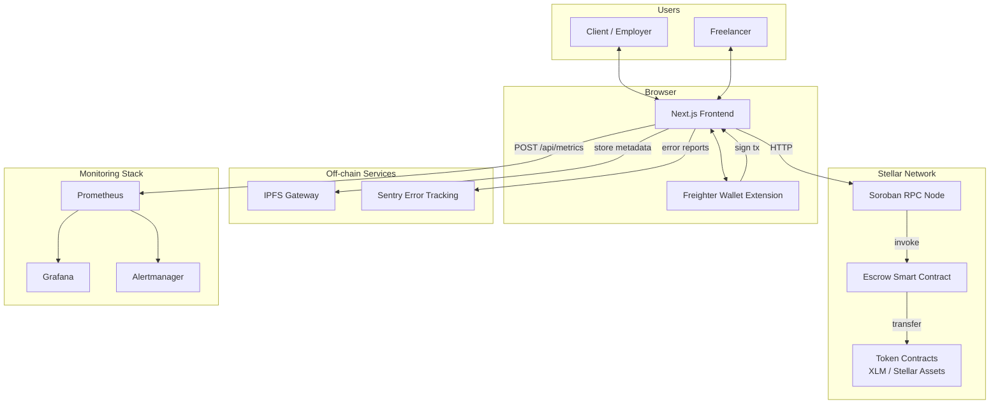
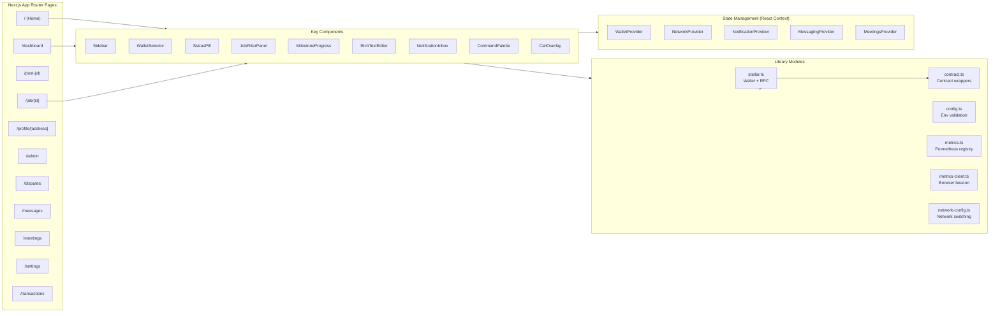
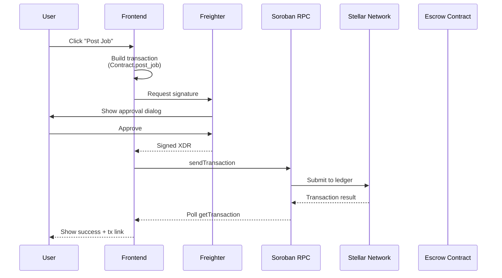
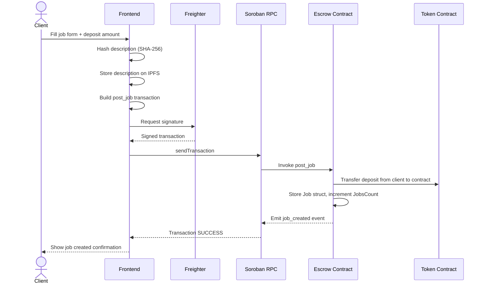
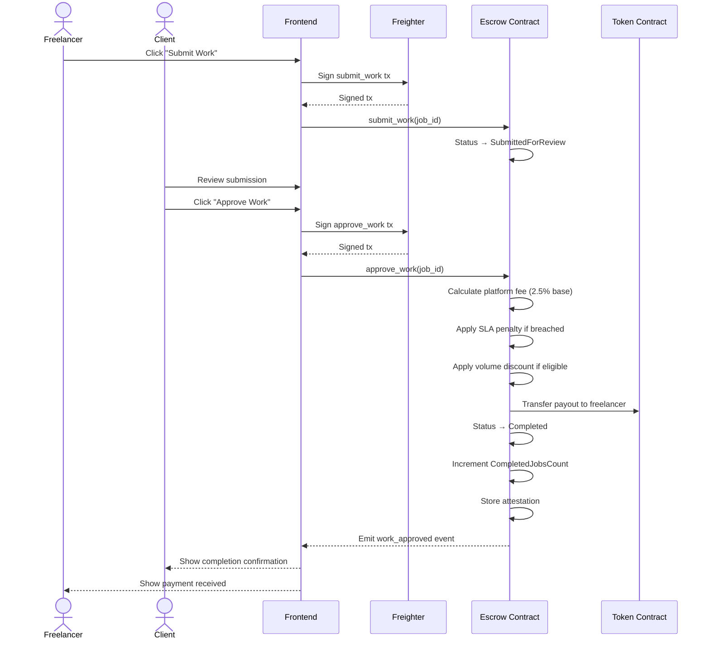
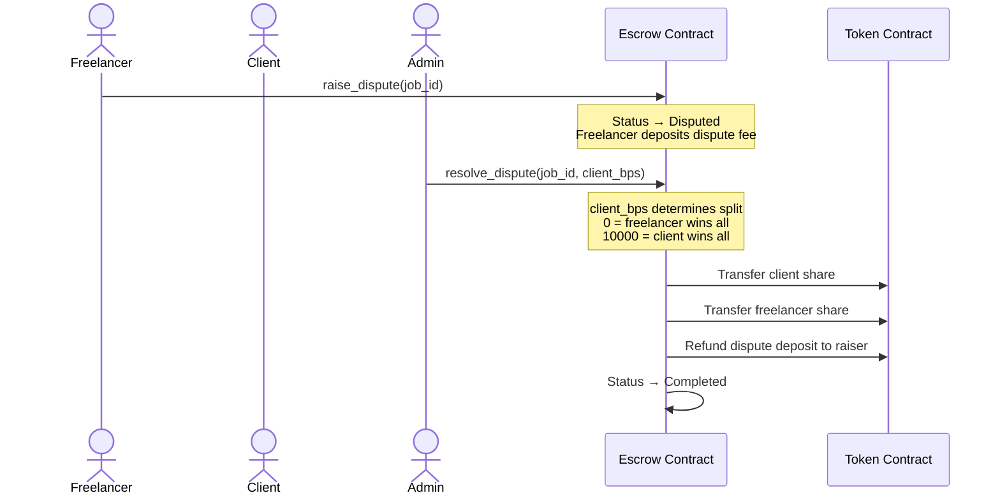
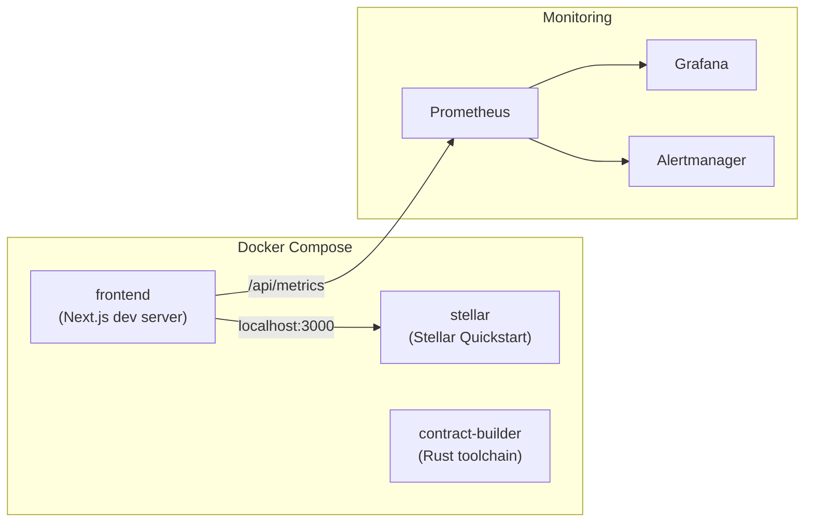
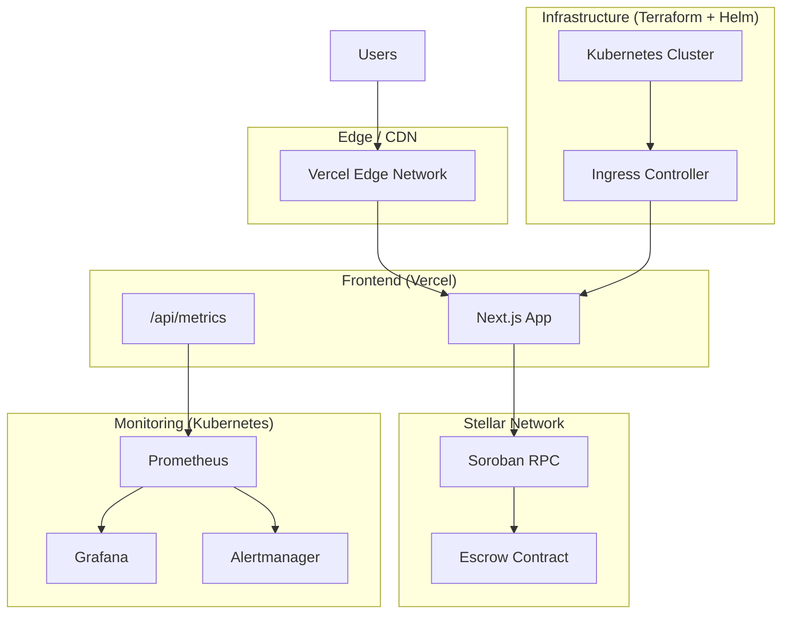

# System Architecture

This document provides a comprehensive overview of the StellarWork platform's system design, component interactions, data flow, and deployment architecture.

## System Context

StellarWork is a decentralized freelancing platform built on the Stellar network using Soroban smart contracts. Users interact through a Next.js frontend, authenticate via the Freighter wallet, and execute trustless escrow transactions on-chain.

## Component Architecture

### Smart Contract Layer

The platform's on-chain logic lives in two Soroban contracts written in Rust:

#### Escrow Contract (`contracts/escrow/`)

The primary contract managing the full job lifecycle.

| Category | Functions | Purpose |
|----------|-----------|---------|
| **Lifecycle** | `post_job`, `accept_job`, `submit_work`, `approve_work`, `cancel_job`, `enforce_deadline`, `mutual_cancel` | Core job state machine transitions |
| **Milestones** | `create_job_with_milestones`, `approve_milestone`, `complete_milestone`, `get_milestones` | Multi-milestone escrow with per-milestone payment release |
| **Disputes** | `raise_dispute`, `resolve_dispute`, `resolve_dispute_split`, `batch_resolve_disputes` | Conflict resolution with configurable split payouts |
| **Fee Management** | `update_fee_bps`, `get_fee_bps`, `withdraw_fees`, `set_discount_tiers`, `calculate_effective_fee_bps` | Platform fee configuration with volume-based discounts |
| **Access Control** | `set_whitelist_mode`, `add_to_whitelist`, `add_to_blacklist`, `set_fee_exemption` | Whitelist/blacklist gating and fee exemptions |
| **Visibility** | `set_job_visibility`, `add_invited_freelancer`, `get_job_visibility` | Public, Private, and InviteOnly job visibility modes |
| **Attestations** | `get_attestation`, `get_user_attestations` | On-chain work completion attestations |
| **Referrals** | `register_referral`, `post_job_with_referral`, `get_referral_earnings`, `withdraw_referral_earnings` | Referral code system with earn-and-withdraw flow |
| **SLA** | `post_job_with_sla`, `get_sla_status` | Service-level agreements with penalty enforcement |
| **Admin** | `admin_get_all_jobs`, `get_dashboard_stats`, `set_paused`, `propose_upgrade` | Administrative oversight and contract governance |
| **Gasless** | `set_trusted_forwarder`, `relay_cancel_job` | Meta-transaction support via trusted forwarders |
| **Payment Splits** | `approve_with_splits`, `set_payment_splits`, `get_available_splits` | Multi-recipient payout splitting |
| **Templates** | (saved via `Template` / `TemplateCount` storage keys) | Reusable job configurations per client |

**Storage Model:**

Soroban provides two storage tiers used by the contract:

- **Instance storage** — configuration and counters that live with the contract instance: `Admin`, `NativeToken`, `FeeBps`, `JobsCount`, `Paused`, `Fees`, `TotalVolume`, `UniqueClients`, `UniqueFreelancers`, `DiscountTiers`, `AllowedTokenCount`
- **Persistent storage** — per-entity data with independent TTL management: `Job(id)`, `AllowedToken(addr)`, `Milestone(job_id, idx)`, `SLAConfig(job_id)`, `Attestation(job_id)`, `ReferralEarnings(addr)`, `Blacklisted(addr)`, `Whitelisted(addr)`, `FreelancerJobs(addr)`, `ClientJobs(addr)`, `PaymentSplit(job_id, idx)`

TTL is actively bumped: active jobs get `518_400` ledger extensions (~30 days), archived jobs get `120_960` (~7 days).

#### Retainer Contract (`contracts/retainer/`)

Manages recurring retainer agreements and cross-chain job portability:

- `create_retainer`, `renew_retainer`, `cancel_retainer` — periodic payment agreements
- `export_job`, `import_job` — cross-chain job migration
- `set_rate_limit`, `set_trusted_address` — rate limiting and trust management

### Frontend Layer

Built with **Next.js 16** (App Router) and **React 19**, deployed to Vercel.

**State management** uses React Context providers — no external state library:

| Provider | Scope |
|----------|-------|
| `WalletProvider` | Wallet connection, account switching, balance, legal consent |
| `NetworkProvider` | Stellar network selection (testnet/futurenet/mainnet) |
| `NotificationProvider` | In-app notification queue |
| `MessagingProvider` | Direct messaging state |
| `MeetingsProvider` | Video call state |
| `TypographyProvider` | Font size preferences |

### Stellar Integration

The frontend communicates with the Stellar network through Soroban RPC:

**RPC interaction patterns:**

- **Transaction building** — `@stellar/stellar-sdk` constructs `TransactionBuilder` with `Contract` invocation
- **Signing** — Freighter extension signs the XDR envelope (`@stellar/freighter-api`)
- **Submission** — `rpc.Server.sendTransaction()` followed by polling `getTransaction()` with exponential backoff (3 retries: 1s, 2s, 4s)
- **Read-only calls** — `simulateTransaction()` for view functions, no signing required
- **Event polling** — Soroban events published by the contract are queryable via `getEvents()`

## Data Flow Diagrams

### Job Posting Flow

### Job Completion & Payment Release Flow

### Dispute Resolution Flow

## Deployment Architecture

### Development

Local development uses Docker Compose with three services:
- **stellar** — Stellar Quickstart image with Soroban RPC on port 8000
- **frontend** — Next.js dev server on port 3000
- **contract-builder** — Rust/Soroban CLI for building and testing contracts

Monitoring stack (`monitoring/docker-compose.monitoring.yml`) adds Prometheus, Grafana, Alertmanager, Blackbox Exporter, and Node Exporter.

### Production

**Production deployment:**
- **Frontend** — Deployed to Vercel with automatic preview deployments on PRs
- **Smart contracts** — Deployed to Stellar mainnet via Soroban CLI; verified on StellarExpert
- **Infrastructure** — Provisioned with Terraform (AWS), orchestrated with Helm charts on Kubernetes
- **Monitoring** — Prometheus scrapes `/api/metrics` every 30s, Grafana dashboards auto-provisioned, Alertmanager routes to Slack

## Tech Stack

| Layer | Technology | Rationale |
|-------|-----------|-----------|
| **Smart Contracts** | Rust + Soroban SDK 21.7 | Stellar's native WASM contract runtime; Rust provides memory safety and performance |
| **Frontend Framework** | Next.js 16 (App Router) | SSR/SSG, API routes, built-in image optimization, Vercel-native |
| **UI** | React 19 + Tailwind CSS 4 | Component model, concurrent features, utility-first styling |
| **Wallet** | Freighter (`@stellar/freighter-api`) | Official Stellar browser wallet; also supports WalletConnect and Ledger |
| **Stellar SDK** | `@stellar/stellar-sdk` 15.x | Transaction building, RPC client, XDR encoding |
| **Rich Text** | TipTap 3.27 | Extensible editor built on ProseMirror; supports links, placeholders |
| **Icons** | Lucide React | Tree-shakeable, consistent icon set |
| **i18n** | next-intl 4.x | Type-safe internationalization with App Router support |
| **Testing** | Vitest + Testing Library + Playwright | Unit tests, component tests, and E2E browser tests |
| **Contract Testing** | Soroban testutils + proptest + cargo-fuzz | Snapshot tests, property-based tests, fuzz testing |
| **Monitoring** | Prometheus + Grafana + Alertmanager | Industry-standard observability stack |
| **Error Tracking** | Sentry | Real-time error monitoring with source maps |
| **CI/CD** | GitHub Actions | Automated lint, typecheck, build, test, deploy pipeline |
| **Deployment** | Vercel (frontend) + Terraform + Helm (infra) | Git-driven deploys with infrastructure as code |
| **Containerization** | Docker + Docker Compose | Consistent local development environment |
| **Security** | CodeQL + pre-commit hooks | Static analysis and commit-time checks |

## Key Design Decisions

### On-chain vs Off-chain Data Split

To optimize cost and performance, data is strategically split:

| Data | Location | Reason |
|------|----------|--------|
| Job state (status, amounts, addresses) | On-chain (Soroban) | Trustless escrow requires authoritative on-chain state |
| Job descriptions, titles, images | Off-chain (IPFS + localStorage) | Large payloads are expensive on-chain; IPFS provides content addressing |
| User profiles, skills, testimonials | Off-chain (localStorage) | Personal data doesn't need consensus |
| Notifications, messages | Off-chain (browser state) | Ephemeral communication data |
| Metrics, telemetry | Off-chain (in-memory + Prometheus) | Operational data for monitoring |

### Fee Architecture

The platform charges a base fee of **2.5% (250 bps)** on every completed job:

- **Volume discounts** — Configurable `DiscountTier` table reduces fees for high-volume freelancers
- **SLA penalties** — Late delivery can incur additional deductions based on `SLAConfig.penalty_bps`
- **Fee exemptions** — Admin can exempt specific addresses from fees
- **Dispute deposits** — 5 XLM default deposit to discourage frivolous disputes; refunded to the raiser

### Contract Upgradeability

The contract supports a governed upgrade path:

1. Admin calls `propose_upgrade(wasm_hash)` — starts a 24-hour timelock
2. After timelock expires, admin calls `execute_upgrade()` — replaces WASM
3. Admin can `cancel_upgrade()` at any time before execution

This prevents surprise contract changes and gives users time to react.
