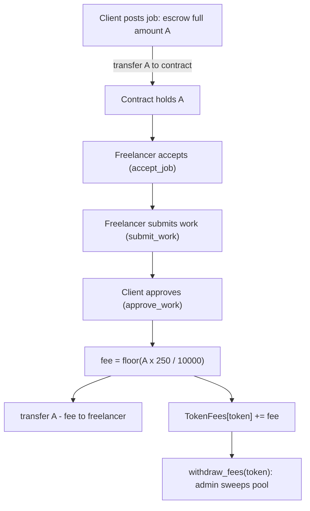
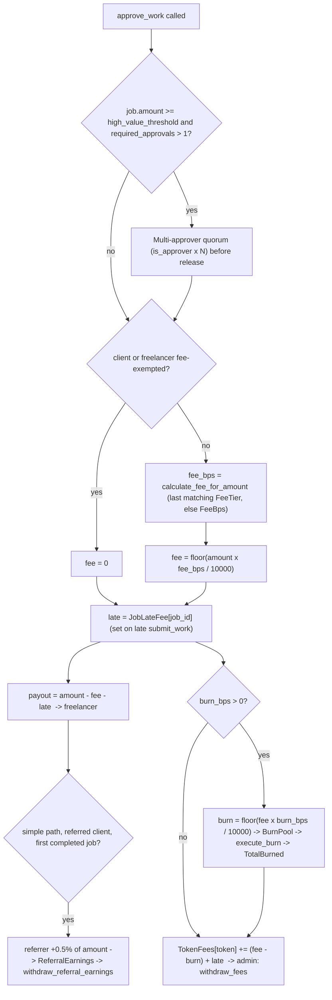
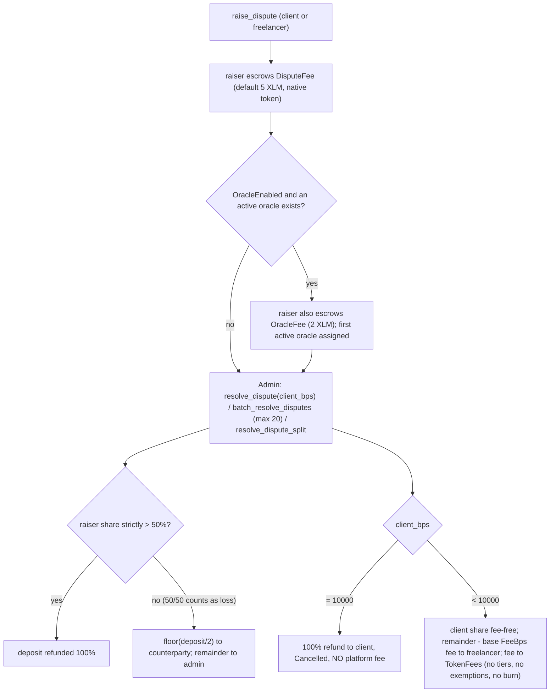
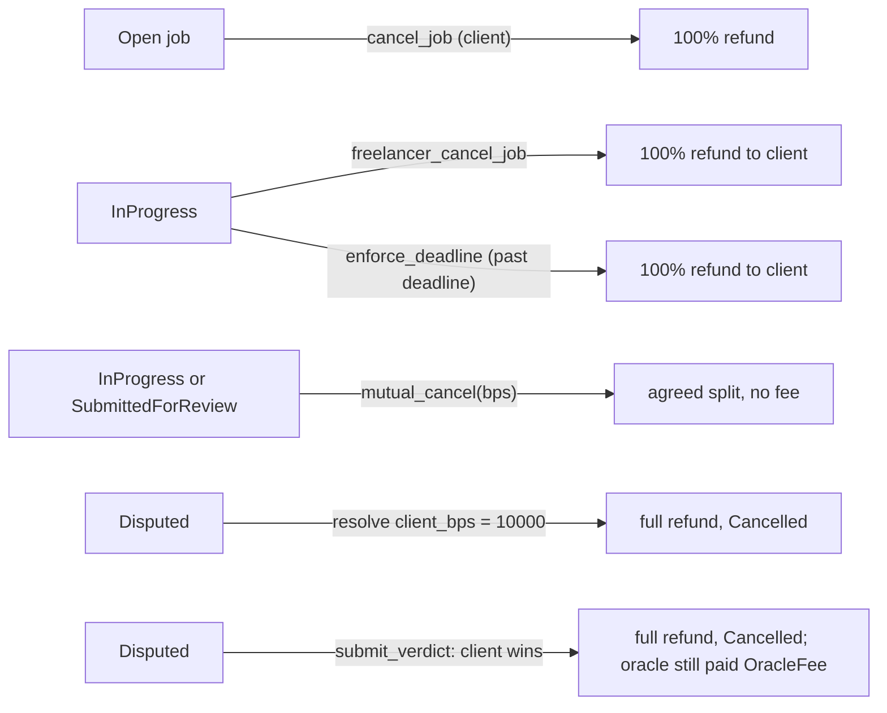

# Tokenomics & Platform Economics

This document is the stakeholder reference for the StellarWork economic model: how fees are
calculated, where every unit of value flows, what incentives each participant faces, and how
sensitive the platform is to fee changes. It also compares StellarWork's take rate with
centralized freelance marketplaces.

Everything here is derived from the **deployed contract logic**, not from a whitepaper. The
source of truth is [`contracts/escrow/src/lib.rs`](../contracts/escrow/src/lib.rs); each claim
below names the function or constant it comes from. A CI-adjacent consistency check
([`scripts/check-tokenomics-docs.py`](../scripts/check-tokenomics-docs.py)) verifies that the
headline constants in this document match the contract and the frontend mirrors.

> Terminology: amounts are denominated in **stroops** (1 XLM = 10,000,000 stroops). Percentages
> quoted in basis points (bps); 100 bps = 1%. Integer division **truncates toward zero**
> everywhere in the contract (see `checked_mul_div`).

## Executive Summary

| Fact | Value | Source |
|------|-------|--------|
| Default platform fee | **250 bps (2.5%)**, charged to the freelancer side | `DEFAULT_FEE_BPS`, `approve_work` |
| When the fee is charged | Only when payment is released (work approved, or dispute resolved in the freelancer's favor) | `approve_work`, `resolve_single_dispute`, `submit_verdict` |
| Fee on refunds/cancellations | **Zero** — full escrow returns to the client | `cancel_job`, `enforce_deadline` |
| Fee accrual | Per-token fee pool in the contract, withdrawn by admin | `DataKey::TokenFees`, `withdraw_fees` |
| Admin fee-update bounds | `update_fee`: 0–1,000 bps (0–10%); `update_fee_bps`: 1–10,000 bps (up to 100%) | `MAX_FEE_BPS`, `MAX_FEE_BPS_CONFIG` |
| Amount-based fee tiers | Up to 10 configurable tiers (implemented, off by default) | `update_fee_tier`, `calculate_fee_for_amount` |
| Late-delivery penalty | Off by default; when on, 100% of the late fee accrues to the platform pool | `set_late_fee_bps`, `submit_work` |
| Dispute filing deposit | 5 XLM default (native token), slashed on a lost dispute | `DEFAULT_DISPUTE_FEE`, `raise_dispute` |
| Oracle fee (optional dispute path) | 2 XLM default, paid to the assigned oracle | `DEFAULT_ORACLE_FEE`, `submit_verdict` |
| Referral reward | 0.5% of the job amount, once per referred client, paid from platform balance | `REFERRAL_BPS` in `approve_work` |
| Fee burn | 0% by default; configurable share of fees locked out of withdrawal | `DEFAULT_BURN_BPS`, `execute_burn` |
| Client-side listing/posting fee | **None** | `post_job_with_categories` |
| Retainer contract | No platform fee at all | `contracts/retainer/src/lib.rs` |

The economic design in one sentence: **the platform earns a small, success-contingent cut of
freelancer payouts, pays nothing out of a client's escrow that the client did not escrow, and
uses at-risk deposits (dispute fees, half-slashing) to price dispute spam.**

## The Economic Model

### Participants and their stakes

| Party | What they put in | What they get out | What they risk |
|-------|------------------|-------------------|----------------|
| Client | Full job amount into escrow at posting (`post_job_with_categories` transfers `amount` to the contract) | Work delivered; automatic full refund if the job is cancelled before acceptance or the deadline is enforced | Opportunity cost of locked funds; timing games (see [Incentives](#incentives-for-each-party)) |
| Freelancer | Work, plus their reputation/rating | `amount − fee − late_fee` on approval, transferred atomically by the contract | Non-payment is prevented by escrow, but partial awards on disputes and the late-fee haircut are live risks |
| Platform admin | Contract deployment, infra, dispute mediation | Accrued `TokenFees` (withdrawable), plus the admin half of slashed dispute deposits | Reputation, custody of the fee pool, admin key security (see `docs/ACCESS_CONTROL.md`) |
| Referrer | A registered referral code (`register_referral`) | 0.5% of the referred client's **first** completed job amount, credited to `ReferralEarnings`, withdrawn in native tokens (`withdraw_referral_earnings`) | Nothing — rewards are contingent on the job completing |
| Oracle | Registration in the oracle pool (`register_oracle`) | The escrowed `oracle_fee` for submitting a verdict (`submit_verdict`) | Assignment without reward if the dispute is admin-resolved first; stake in accuracy is reputational |
| Relayer / forwarder | Transaction fees for gasless users (`relay_cancel_job`, trusted-forwarder whitelist) | No protocol fee — goodwill/auxiliary revenue | Network fees they front |

### Where platform money comes from

The escrow contract is self-funding through exactly four inflows:

1. **Platform fee** on released payouts (the dominant source).
2. **Late fees** deducted from freelancer payouts (100% to the platform pool).
3. **The admin's half of slashed dispute deposits** (the other half goes to the counterparty).
4. Nothing else — listing, escrow funding, cancellation, and refunds are free.

Fee-related outflows/reductions: **burn allocation** (shares of fees removed from the
withdrawable pool) and **referral bonuses** (credited from contract balance). See
[Sensitivity Analysis](#sensitivity-analysis-of-fee-changes) for how these interact with the
take rate.

### Tokens

- Any admin-whitelisted token can fund a job (`add_allowed_token`, `is_token_allowed`); XLM
  (native) is registered automatically in `initialize`.
- The **dispute deposit and oracle fee are always charged in the native token** regardless of the
  job's escrow token (`raise_dispute` → `load_native_token`).
- **Referral earnings are accounted and paid in native-token units** even when the job escrowed a
  different token (`approve_work` credits `amount × 50 bps` of the *job token amount*, and
  `withdraw_referral_earnings` pays that many stroops of the native token). See caveats.

## Fee Calculation and Distribution

### The platform fee formula

On `approve_work` (both the simple client-approval path and the multi-approver path), and on
`submit_verdict` when the freelancer wins:

```text
fee_bps  = calculate_fee_for_amount(job.amount)      # tier-aware rate, see below
fee      = floor(job.amount × fee_bps / 10_000)      # checked_mul_div, truncating
payout   = job.amount − fee − late_fee               # late_fee ≥ 0, per job
TokenFees[job.token] += (fee − burn_amount) + late_fee
burn_amount = floor(fee × burn_bps / 10_000)          # burn_bps default 0 → no burn
```

Key properties, all verifiable in `approve_work`:

- **Fee base is the full job amount**, including any `top_up_escrow` additions — not just what
  was paid out.
- **Rounding truncates in the freelancer's favor.** A 39-stroop job pays 0 fee
  (`39 × 250 / 10,000 = 0.975 → 0`), matching the `approve_work_39_stroops_fee_split` test.
  Value is conserved: `fee + payout (+ late_fee) == escrow` on every completion.
- **No fee is charged on client refunds.** Full-refund paths (`cancel_job`,
  `freelancer_cancel_job`, `enforce_deadline`, `resolve_single_dispute` with `client_bps =
  10_000`, `submit_verdict` with a client win) transfer `job.amount` back untouched.
- **`mutual_cancel` splits are fee-free.** Both parties authorize `client_share_bps` and each
  side receives its share with no platform cut — the platform is paid only for *completed* work.

### Fee tiers (implemented; inactive until configured)

`calculate_fee_for_amount` checks `FeeTierCount` (max `MAX_FEE_TIERS = 10`). With zero tiers —
the shipped default — every job pays the base `FeeBps` (250). Admins add tiers via
`update_fee_tier(index, min_amount, fee_bps)` where `1 ≤ fee_bps ≤ 10_000`. Matching is:

```text
matched = base_fee_bps
for i in 0..tier_count:
    if amount >= tiers[i].min_amount:   # last match wins, not the best match
        matched = tiers[i].fee_bps
```

Two consequences stakeholders should know:

1. Tiers are an **override ladder**, not a progressive marginal schedule. A job matching a tier
   pays that tier's rate on the *whole* amount. A 10,000 XLM job in a "150 bps above 5,000"
   tier pays 1.5% on all 10,000 XLM — not blended.
2. Evaluation is **by index order, and the last matching tier wins**. Correct behavior requires
   admins to register tiers in ascending `min_amount` order. `min_amount` itself is not
   validated (it may be ≤ 0), so a tier at index 0 with `min_amount = 0` overrides the base fee
   for every job.

Worked ladder example (base 250 bps; tier 0: `min_amount` = 10,000 XLM → 200 bps; tier 1:
`min_amount` = 50,000 XLM → 150 bps):

| Job amount | Effective rate |
|------------|----------------|
| 5,000 XLM | 2.50% |
| 20,000 XLM | 2.00% |
| 60,000 XLM | 1.50% |

### Fee exemptions

`set_fee_exemption(admin, address, true)` puts an address on a permanent (TTL-bumped) exemption
list. In `approve_work`, if **either** the client or the freelancer is exempted, `fee = 0` —
though the late fee is still deducted and still accrues to the platform. Exemptions are checked
on both approval paths but **not** in the dispute-resolution paths (`resolve_single_dispute`,
`resolve_dispute_split`, `submit_verdict` all charge the fee regardless of exemption status).

### Distribution: accrual, withdrawal, burn

Fees are never swept on the fly; they are booked to a per-token ledger inside the contract:

1. Each completion adds `fee − burn_amount + late_fee` to `TokenFees[platform-fee token]`
   (`get_fees(token)` reads it; it is an IOU against the contract balance).
2. `withdraw_fees(token)` (admin-only) zeroes `TokenFees[token]` and transfers that amount from
   the contract to the admin address, emitting `fees_withdrawn`. The contract's token balance
   therefore equals `live escrows + accrued-but-unwithdrawn fees + referral obligations + burn
   pool`, because escrow funding, payouts, and fee accrual all happen against one balance.
3. When `burn_bps > 0` (set via `update_burn_percentage`, 0–10,000), `floor(fee × burn_bps /
   10_000)` is **excluded from the withdrawable pool** and added to `BurnPool`. `execute_burn`
   (admin) decrements `BurnPool` and increments `TotalBurned` and emits `tokens_burned`.

**Important nuance:** `execute_burn` currently reclassifies *internal accounting*; the contract
does not call the token's `burn()` entrypoint. The burned units stay inside the contract address
but are permanently outside every withdrawable ledger (not recoverable via `withdraw_fees`). For
a truly deflationary token, a token whose supply the admin address controls (e.g. an anchored
asset) would need an actual burn on the issuer side. This is a known gap, not a bug in the fee
math: conservation still holds because burned amounts are no longer owed to anyone.

### Worked examples

All at default 250 bps, no tiers, no exemptions, burn 0, no late fee:

| Job amount (XLM) | Fee (stroops) | Fee (XLM) | Freelancer payout (XLM) |
|------------------|---------------|-----------|-------------------------|
| 10 | 2,500,000 | 0.25 | 9.75 |
| 100 | 25,000,000 | 2.50 | 97.50 |
| 1,000 | 250,000,000 | 25.00 | 975.00 |
| 10,000 | 2,500,000,000 | 250.00 | 9,750.00 |
| 39 **stroops** | 0 (truncated) | 0.00 | 39 stroops |

With a 500 bps late fee enabled on the 1,000 XLM job: late fee = 50 XLM, payout =
1,000 − 25 − 50 = 925 XLM, and the platform accrues 25 + 50 = 75 XLM (late fees are 100%
platform revenue).

With `burn_bps = 2,500` on the same job: burn = `250,000,000 × 0.25 = 62,500,000` stroops
(6.25 XLM) into `BurnPool`; withdrawable accrual drops to 18.75 XLM (effective platform take
1.875%).

### Fee calculation flow (waterfall, per approved job)

```text
                       escrowed amount A (funded at posting)
                                    │
                        ┌───────────▼────────────┐
                        │  approve_work / oracle │
                        └───────────┬────────────┘
                                    │
              fee_bps = calculate_fee_for_amount(A)      (tier ladder or base 250)
              fee     = floor(A × fee_bps ÷ 10,000)
              late    = JobLateFee[job]                  (0 if on-time or disabled)
                                    │
        ┌───────────────────────────┼───────────────────────────────┐
        │                           │                               │
        ▼                           ▼                               ▼
  payout to freelancer        burn_amount                      residual fee
  A − fee − late              fee × burn_bps ÷ 10,000          fee − burn_amount
  (one token transfer)        → BurnPool (locked)              + late → TokenFees
                                                            → admin via withdraw_fees
```

Invariants, each covered by contract tests (`a_hundred_percent_fee_leaves_the_freelancer_nothing_but_conserves_value`,
`a_one_stroop_job_completes_with_the_fee_rounding_to_zero`, `a_large_amount_still_conserves_value`):

- `payout + fee + burn_amount == A − late_fee + late_fee` → total out == total in, always.
- `0 ≤ fee ≤ A` (bounded by `MAX_FEE_BPS_CONFIG = 10_000` = 100%; a 100% fee is legal in the
  `update_fee_bps` path — flagged in [Governance and safety bounds](#governance-and-safety-bounds)).
- Overflows revert with `InsufficientFunds` via `checked_mul_div` (a max-`i128` job amount fails
  to fund, per `a_max_i128_amount_cannot_be_funded`).

## Other Monetary Flows

### Late fee (delivery-delay surcharge)

Off by default. When admin enables it (`set_late_fee_enabled(true)`, `set_late_fee_bps(bps ≤
10_000)`):

- A late `submit_work` no longer reverts with `DeadlinePassed`; instead
  `late_fee = floor(amount × late_bps / 10_000)` is stored per job (`ExtKey::JobLateFee`),
  emitted as `late_fee_accrued`, **subtracted from the freelancer payout**, and **added in full to
  `TokenFees`** at approval.
- The late fee is computed from the job amount at submission time; `get_late_fee(job_id)` reads
  it back at approval.
- Fee-exempted parties still pay the late fee (it is deducted before accrual).

Economically this is a **deadline-alignment toll**: the platform monetizes lateness, and disabling
the feature converts lateness into a hard revert (deadline becomes a cliff). There is no
time-decay sliding scale.

### Dispute deposit and slashing

`raise_dispute` (either party, `InProgress`/`SubmittedForReview` only) escrows a
**`DisputeFee` deposit in native tokens** to the contract — default `50_000_000` stroops =
**5 XLM**, admin-configurable to any non-negative value (`update_dispute_fee`; 0 disables).
On `resolve_single_dispute`:

- **Raiser wins** (their awarded share is *strictly* over 50%): deposit refunded in full.
- **Raiser loses** (share ≤ 50% — an exact 50/50 split counts as a loss for the raiser): the
  deposit is slashed — `floor(deposit / 2)` to the counterparty, the remainder (odd stroops
  included) to the admin.

`resolve_dispute(client_bps)` and `resolve_dispute_split(client_payout_bps)` use
`client_bps ∈ [0, 10_000]`:

- `client_bps == 10_000`: full refund, status `Cancelled`, **no platform fee**.
- otherwise: client receives their share **fee-free**; the freelancer's remainder is reduced by
  the base `FeeBps` fee (note: **not** the tier-aware rate — dispute paths read
  `get_fee_bps_storage` directly), and that fee accrues to `TokenFees`.
- `batch_resolve_disputes` settles up to `MAX_BATCH_DISPUTES = 20` atomically (same economics).

### Oracle dispute path (optional, off by default)

When `OracleEnabled` (default false) and `raise_dispute` finds an active oracle
(`assign_oracle_from_pool` takes the **first active** oracle in list order — not round-robin),
the raiser additionally escrows the `OracleFee` (default **2 XLM**) to the contract. On
`submit_verdict`:

- The oracle is paid the 2 XLM from contract balance.
- **Client wins**: full refund, `Cancelled`, no fee.
- **Freelancer wins**: normal fee math — but this path *does* use `calculate_fee_for_amount`
  (tier-aware), unlike the admin-resolve paths.

If the dispute is instead resolved by the admin (`resolve_dispute*`), the oracle fee currently
escrowed by the raiser is **not** refunded by that code path (only `DisputeFeePaid` is cleared).
Stakeholders should treat the oracle fee as spent at assignment.

### Referral system (a platform-funded negative fee)

- Anyone registers a unique code (`register_referral`); self-referral is rejected and the first
  link for a client is sticky (`ClientReferrer`).
- On the client's **first completed job**, `approve_work` credits the referrer
  `floor(job.amount × 50 / 10_000)` (0.5%) once (`ReferralBonusPaid` latch) and emits
  `referral_bonus_credited`.
- `withdraw_referral_earnings` pays out **native tokens from the contract balance** — i.e.,
  referral rewards are economically funded by the platform's accrued fees (before withdrawal) or
  its float, at a 1:1 nominal stroop count against the *job token's* amount. If a job escrowed a
  token other than XLM, the credit is 0.5% of that token's amount but paid in XLM stroops.
- Not paid on the multi-approver finalization path, and not paid when the first job completes via
  a dispute/oracle resolution (only `approve_work`'s simple path runs the referral block).

### Cancellations, refunds, and top-ups

| Action | Who / when | Money movement | Platform revenue |
|--------|-----------|----------------|------------------|
| `cancel_job` | client, `Open` only | 100% refund | none |
| `freelancer_cancel_job` | assigned freelancer, `InProgress` | 100% refund to client; freelancer earns nothing | none |
| `enforce_deadline` | client, `InProgress`, past deadline | 100% refund to client | none |
| `mutual_cancel(client_share_bps)` | both parties, `InProgress`/`SubmittedForReview` | agreed split of escrow | none |
| `top_up_escrow` | client, before completion | adds to escrow and to the fee base | fee applies to the new total at approval |
| `relay_cancel_job` | whitelisted trusted forwarder on client's behalf | as `cancel_job` | none (relayer fronts network fee) |

There is **no cancellation fee and no escrow-interest clawback**: clients can post, hold, and
refund at zero protocol cost, and freelancers can walk from `InProgress` without forfeiting
money (only the job and rating exposure). The only "sunk" user cost before completion is the
dispute deposit at dispute time.

### Network and operational costs (not platform revenue)

Every user action carries Stellar network fees (base fee ≈ 0.00001 XLM per operation; the
frontend fee calculator uses ≈ 0.0012 XLM/tx). Escrow funding, payout, refunds, and deposits are
each token transfers within one or more transactions. These costs never accrue to the platform;
with trusted relayers (`set_trusted_forwarder`) they can be absorbed by a forwarder for a
gasless UX.

## Fee Flow Diagrams

### Happy path (2.5% base fee, burn off)



### Full fee waterfall (tiers, late fee, burn, referral, multi-approver)



### Dispute path (deposits and slashing)



### Refund / cancellation flows (zero-revenue branches)



## Incentives for Each Party

### Client

- **Pay-into-escrow at posting** removes the freelancer's non-payment risk; the client's own
    downside is bounded: unused escrow is fully refundable while `Open`, and refundable on
    deadline breach (`enforce_deadline`).
- **Approval is the client's only lever with fee impact** — they cannot "shop" the fee (it is
    paid from the freelancer side of the payout), so honest approval timing is weakly dominant
    versus delaying: delaying only invites disputes and recovery, and `propose_recovery` (48 h
    timelock, multi-signer) can release funds without them after
    `DEFAULT_STUCK_THRESHOLD_SECS = 7 days`.
- **Zero listing fee + zero cancel fee** encourages posting freely; the cost of a bad match is
    only opportunity cost and network fees.
- Residual risks priced by design: dispute filing costs 5 XLM at-risk (deters trivial claims);
    a 50/50 resolution counts as *loss* for the raiser, so neither side can profit from
    nuisance disputes or split-the-baby fishing.

### Freelancer

- **Guaranteed payment**: funds sit in the contract from posting; `approve_work` releases
    `amount − fee − late` atomically. There is no invoice-chasing.
- **The 2.5% fee is the price of that guarantee**, and it is small relative to the
    disintermediation alternative (see sensitivity analysis): leaving the platform to save 2.5%
    means self-custodying against non-payment, scope creep, and refund fraud.
- **Deadline discipline**: with late fees enabled, shipping after the deadline is an
    amount-proportional toll paid to the platform; with them disabled (the default), a late
    submission simply reverts — pushing both parties toward `extend_deadline` negotiation or
    dispute.
- **Reputation economy**: `rate_job`/`rate_freelancer` averages plus an optional
    `min_rating_to_accept` gate (verified freelancers can be exempted via
    `set_exempt_verified_freelancers`) and `verify_freelancer` badges form the demand-side
    flywheel — verified, high-rated freelancers win the matching that the low fee makes worth
    having.
- **Asymmetric dispute exposure**: after `SubmittedForReview`, raising a dispute also costs the
    freelancer the deposit, and losing forfeits half of it to the counterparty.

### Platform admin (the business)

- Revenue scales with **completed GMV only** — the fee model is aligned with users: money is
    earned when work ships, not when jobs are posted. Nothing is collectible from spam listings.
- **Fee ceiling is enforced on-chain** (`FeeTooHigh` beyond `MAX_FEE_BPS` on `update_fee`;
    ≤ `MAX_FEE_BPS_CONFIG` on `update_fee_bps`), so users can verify a maximum extractable rate
    from the deployed bytecode. The mismatch (10% vs 100% bounds between the two setters) is a
    governance decision the community should resolve — documented in
    [Governance and safety bounds](#governance-and-safety-bounds).
- **Dispute deposits subsidize moderation**: the admin's half of every slashed deposit is direct
    revenue for mediation effort, priced to deter abuse rather than to earn (at default 5 XLM,
    this is rounding error next to the 2.5% fee — see sensitivity).
- **Float custody risk**: fees, referral obligations, burn pool, and escrow all share one
    contract balance; `withdraw_fees` moving real tokens is a concentrated trust point until DAO
    governance (mitigations: upgrade timelock `UPGRADE_TIMELOCK_SECS = 86_400` (24 h),
    two-step ownership transfer, `docs/ACCESS_CONTROL.md`).

### Referrer

- 50 bps paid **once, only after the referred client's first completed job**: a growth incentive
    that cannot be farmed by sign-ups or by posting-then-cancelling (completion is the trigger),
    and is capped per client (`ReferralBonusPaid`), bounding acquisition spend to 0.5% of
    first-job GMV.

### Oracle

- A fixed, pre-escrowed fee (2 XLM) paid from contract balance upon `submit_verdict`, only to
    the address assigned for that dispute, and only if `is_active`. Revenue is flat per case, so
    oracle economics favor volume and fair call rates (reputation via the `Oracle.name`/`url`
    registry), not outcome-dependent pay, which would bias verdicts.

### Alignment and tension map

| Tension | Design response |
|---------|-----------------|
| Client approves work never received | Escrow + freelancer can `raise_dispute`; deposit deters false disputes |
| Freelancer never submits after accepting | `enforce_deadline` refunds the client; reputation ledger |
| Both parties collude to wash referral rewards | Bonus tied to *completion*, once per client, self-referral rejected |
| Platform raises fees punitively after users are locked in | On-chain caps, `fee_updated` event, upgrade timelock, open-source math |
| Dispute mediation is costly | At-risk deposits make frivolous filing self-funding for the process |
| Fee charged on money refunded to the client | Structurally impossible: refunds bypass fee accrual in every path |

## Sensitivity Analysis of Fee Changes

### Revenue sensitivity to the headline rate

Platform fee revenue is linear in `fee_bps` by construction
(`fee = floor(amount × fee_bps / 10_000)`), so per unit of completed GMV:

| Fee (bps) | Rate | Revenue per $100k GMV | per $1M | per $10M |
|-----------|------|----------------------|---------|----------|
| 100 | 1.0% | $1,000 | $10,000 | $100,000 |
| 150 | 1.5% | $1,500 | $15,000 | $150,000 |
| **250 (default)** | **2.5%** | **$2,500** | **$25,000** | **$250,000** |
| 400 | 4.0% | $4,000 | $40,000 | $400,000 |
| 500 | 5.0% | $5,000 | $50,000 | $500,000 |
| 1,000 (cap of `update_fee`) | 10% | $10,000 | $100,000 | $1,000,000 |

Rule of thumb: **every 100 bps ≈ $1,000 of revenue per $100k of completed GMV.** Halving the fee
to 125 bps halves revenue unless it more than doubles throughput; doubling to 500 bps doubles
revenue unless it drives more than ~50% of GMV off-platform or to fee-exempt deals.

### Breakeven view

Required monthly GMV = monthly cost ÷ fee rate. For illustrative infra + audit + support cost
levels:

| Monthly cost | @100 bps | @250 bps | @500 bps | @1,000 bps |
|--------------|----------|----------|----------|------------|
| $1,000 | $100k | $40k | $20k | $10k |
| $3,000 | $300k | $120k | $60k | $30k |
| $10,000 | $1.0M | $400k | $200k | $100k |

At the default 2.5%, the platform needs only ~$4k/day of completed volume to cover a $3k/month
operating budget — which is why the strategic question is not "can we raise fees" but "does each
extra basis point survive comparison with the alternatives below."

### The disintermediation constraint (why the fee can't simply rise)

A $1,000 job completed off-platform saves the freelancer the whole fee but forfeits the escrow
guarantee. Freelancer take-home per $1,000 of work:

| Platform | Seller take | Net to freelancer |
|----------|-------------|-------------------|
| **StellarWork @250 bps** | 2.5% | **$975** |
| Contra (0%, client pays $35/mo sub) | 0% | $1,000 |
| Upwork (variable 0–15% per contract since May 2025, ~10% typical) | ~10% | ~$900 |
| Freelancer.com | 10% (+$5 per-project bid fees) | $900 |
| LaborX (Web3 escrow comparable) | 10% (rebates to ~5% w/ staking) | $900–$950 |
| Fiverr | 20% (+5.5% buyer fee, +$3.50 on orders < $200) | $800 |

StellarWork's fee is ~4× below Upwork's typical rate and ~8× below Fiverr's. The practical
ceiling for any fee increase is "cheaper than the median alternative plus the escrow-risk
premium a freelancer self-bears off-platform." At 2.5% that gap is ≈ 7.5 points of headroom; at
10% (the `update_fee` cap) the price advantage disappears entirely and only the product (escrow,
on-chain attestation, disputability) carries the value proposition. That is the sensitivity that
matters most when `fee_bps` moves.

### Rounding and micro-jobs

Truncating floor division means **jobs below 40 stroops (0.000004 XLM) pay no fee at all**
(250 bps of 39 stroops = 0.975 → 0), and in general the realized rate is `floor(A × bps ÷ 10⁴)/A
≤ nominal`. Micro-jobs are therefore economically free at the protocol layer but still cost
network fees, so fee leakage on tiny jobs is self-limiting. If the strategy is a *low* fee,
remember the converse: low-fee + micro-jobs = near-zero revenue, and only volume pays.

### Dispute-fee sensitivity (spam pricing)

The 5 XLM deposit as a share of the escrow at stake:

| Job size | Deposit friction |
|----------|------------------|
| 10 XLM | 50% |
| 100 XLM | 5% |
| 1,000 XLM | 0.5% |
| 10,000 XLM | 0.05% |

Raising the deposit deters small-job disputes almost entirely (a 10 XLM deposit makes a 10 XLM
job 100% friction) while barely touching large-job behavior — i.e., it is **regressive** in
access-to-justice terms. It is also a fixed XLM amount, so its real-world friction drifts with
the XLM price. The 50/50-is-a-loss rule is the load-bearing part of the deterrent: it removes
any expected gain from filing to force a split. If deposits are ever zeroed
(`update_dispute_fee(0)`), the anti-spam mechanism disappears and admin mediation volume becomes
the only constraint on dispute count.

### Late-fee and burn sensitivity

- **Late fee**: linear in `late_bps` on the job amount, like the platform fee (500 bps on a
    1,000 XLM job = 100 XLM). Since 100% flows to `TokenFees`, enabling `late_fee_bps` is a
    **hidden revenue knob** whose realized revenue = (late submissions × amount × bps ÷ 10⁴).
    Its behavioral cost is the cliff-vs-toll trade-off above; its revenue cost when *disabled* is
    that every late completion is simply blocked, pushing jobs into dispute (where resolution
    fees still accrue, but mediation effort rises).
- **Burn**: at `burn_bps = B`, the platform keeps `fee × (10⁴ − B)/10⁴`. On a 1,000 XLM job at
    default fee, `burn_bps = 2,500` (25% of fees) burns 6.25 XLM and cuts platform take from
    25 → 18.75 XLM (2.5% → 1.875% effective). Burn is a fee cut wearing a tokenomics hat: model
    its sensitivity exactly like reducing `fee_bps`, except the reduction is permanent per unit
    (units leave the withdrawable system) instead of being shared back with users — and note the
    accounting-vs-actual-destruction caveat in [Distribution](#distribution-accrual-withdrawal-burn).
- **Referral budget**: each referred first-job completion costs the platform 0.5% of that job —
    20% of the default 2.5% fee on that same job. At 100% referral penetration, effective net
    take drops from 250 to ~200 bps. There is no global referral budget in the contract; bound
    program spend via tiers/exemptions, not by assuming it self-limits.

### Parameter interaction table

| Change | Direct revenue effect | Expected second-order effects |
|--------|----------------------|-------------------------------|
| `fee_bps` ↑ +100 bps | +$1,000 per $100k GMV | Off-platform migration risk; pressure toward tiers/exemptions as escape valves |
| Fee tiers at high `min_amount` | −bps on large jobs only | Large jobs are the ones most able to leave; retention likely nets positive |
| `dispute_fee` ↑ | +admin half of lost deposits | Fewer (esp. small-job) disputes; grievances shift to `enforce_deadline`/recovery paths |
| `late_fee_bps` ↑ | +late submissions × amount × bps | Pushes users to free `extend_deadline` or to disputes; cliff ↔ toll trade-off |
| `burn_bps` ↑ | −(withdrawable fees) | Credibility/deflation narrative only, given current accounting-style burn |
| `oracle_fee` ↑ | neutral (raiser → oracle, via contract) | Higher dispute entry cost; oracle pool shrinks if fee < oracle opportunity cost |

## Economic Parameters Reference

| Parameter | Storage key | Default | Bounds (who sets) | Contract surface |
|-----------|------------|---------|--------------------|------------------|
| Platform fee bps | `DataKey::FeeBps` | 250 | `update_fee`: 0–1,000; `update_fee_bps`: 1–10,000 (admin) | `get_fee_bps()` view |
| Fee tiers | `FeeTier(i)`, `FeeTierCount` | none (0 tiers) | ≤ `MAX_FEE_TIERS = 10`; tier bps 1–10,000; `min_amount` unvalidated (admin) | `update_fee_tier`, `get_fee_tiers` |
| Late fee bps | `ExtKey::LateFeeBps` | 0 (and disabled) | 0–10,000 (admin) | `set_late_fee_bps`, `set_late_fee_enabled` |
| Dispute deposit | `DataKey::DisputeFee` | 50,000,000 stroops (5 XLM) | ≥ 0 (admin); 0 disables | `update_dispute_fee`, `get_dispute_fee` |
| Oracle fee | instance storage | 20,000,000 stroops (2 XLM) | ≥ 0 (admin) | `update_oracle_fee`, `get_oracle_fee` |
| Oracle mode | `DataKey::OracleEnabled` | false | bool (admin) | `set_oracle_enabled` |
| Burn share of fee | `DataKey::BurnPercentage` | 0 | 0–10,000 (admin) | `update_burn_percentage`, `execute_burn`, `get_burn_pool_balance`, `get_total_burned` |
| Referral bonus | `REFERRAL_BPS` (compile-time) | 50 (0.5%), once per client | fixed in code | `register_referral`, `post_job_with_referral`, `withdraw_referral_earnings` |
| Fee exemptions | `DataKey::FeeExempted(addr)` | none | bool (admin) | `set_fee_exemption`, `is_fee_exempted` |
| High-value approvals | `HighValueThreshold` / `RequiredApprovals` | effectively off (`i128::MAX`, 1) | admin | `set_high_value_threshold`, `set_required_approvals`, `add_approver` |
| Accrued fees per token | `DataKey::TokenFees(addr)` | 0 | written only by payout logic | `get_fees`, `withdraw_fees` |
| Active jobs per user | `DataKey::MaxJobsPerUser` | 50 | admin | `set_max_jobs_per_user` |

## Governance and Safety Bounds

- **Admin-only**: every monetary parameter above is set by the admin address with
    `require_auth` (`load_admin`). Admin rotation is two-step (`transfer_ownership` +
    `accept_ownership`); see `docs/ACCESS_CONTROL.md` and `docs/admin-key-rotation.md`.
- **On-chain caps**: `update_fee` reverts with `FeeTooHigh` beyond 1,000 bps; `update_fee_bps`
    and `update_fee_tier` cap at 10,000 bps. ⚠️ The two setters disagree (0–10% vs 1–100%): any
    stakeholder reading "fees are capped at 10%" should verify *which* setter the deployment
    exposes. Recommended: deprecate or align `update_fee_bps` (e.g., cap at `MAX_FEE_BPS`) in
    the next upgrade, or wire it behind a timelocked governance proposal.
- **No retroactive repricing**: `fee_bps` is read at approval time; changing it does not
    re-price the escrowed balances of in-flight jobs, only their future payout split.
- **Upgrades**: `propose_upgrade` → `execute_upgrade` after `UPGRADE_TIMELOCK_SECS` (24 h) —
    fee logic itself can change, with a day for users to react; the pending wasm hash is public.
- **Transparency**: fee changes emit `fee_updated`; withdrawals emit `fees_withdrawn`; every
    payout event includes `payout`, so anyone can recompute `fee = escrow − payout − late`
    from the chain.
- **Roadmap**: fee policy via DAO governance (Phase 3 in the project README's governance
    section). Until then, treat "fee policy" as "admin policy constrained by the caps above."

## Competitive Comparison

Fees as publicly documented by each platform (September 2026 — platform fees change often;
re-verify before citing externally):

| Platform | Freelancer fee | Client fee | Escrow of funds | Settlement rail | Blended take rate (approx.) |
|----------|---------------|------------|----------------|-----------------|------------------------------|
| **StellarWork** | **2.5%** (250 bps) on completion, zero on refunds | 0% | On-chain Soroban escrow, always the full amount | XLM + whitelisted tokens, seconds | **~2.5%** |
| Upwork | Variable 0–15% per contract since May 2025 (was a flat 10%; before 2023-2025 a 20/10/5% ladder) | ~5%+ marketplace fee; Connects to bid | Optional Direct Contracts (off-platform), platform holds otherwise | Bank/card rails, days | ~15–20%+ |
| Fiverr | 20% commission (incl. tips) | 5.5% service fee + $3.50 on orders under $200 | Centralized clearing, 14-day hold | Card/bank + Fiverr Revenue Card | ~26–35% |
| Freelancer.com | 10% (fixed projects), 10% hourly | $5 fee per project bid | Centralized | Bank/card | ~15%+ |
| Toptal | None visible (screened network) | Hidden in ~30%+ client markup | n/a | Bank | ~30% |
| Contra | 0% | $35/mo Pro membership; Stripe 2.9% + $0.30 on payments | None | Stripe | ~3–5% + fixed sub |
| LaborX (Web3 comparable) | 10%, rebated up to half via TIME staking (→ ~5%) | 0% | Smart-contract escrow | Crypto (ERC-20/native) | ~5–10% |
| Guru | 5–9% depending on membership tier | varies | Centralized | Bank/card | ~9%+ |

StellarWork's differentiation is *both* a lower take rate **and** a different cost structure: no
payment processing (Stellar settles), no listing monetization (no Connects equivalent), no wage
withholding or FX spreads, and mediation partly self-funded by slashed deposits instead of
staffing overhead loaded into fees. The trade-offs stakeholders should see clearly: no
buyer-protection insurance, no tax/VAT tooling, discovery network effects are small today, and
oracle/admin mediation quality is the operator's process, not a protocol guarantee.

Sources:
[Upwork flat-10% coverage](https://freelancercalculator.com/upwork-service-fee-10-percent-official-explained-2026/),
[Upwork variable-fee explainer](https://www.jobbers.io/upwork-vs-free-platforms-real-cost-comparison-for-freelancers-in-2025/),
[Fiverr/Contra comparison](https://earnifyhub.com/blog/contra-vs-fiverr-commission),
[fee encyclopedia table](https://www.jobbers.io/the-freelance-platform-fee-encyclopedia-every-fee-on-every-platform-documented/),
[LaborX fees](https://laborx.com/).

## Auditability

The fee system is fully observable from chain, per job:

| Event | Emitted by | Fee-relevant payload |
|-------|-----------|----------------------|
| `job_created` | `post_job*` | escrowed `amount`, `token` |
| `late_fee_accrued` | late `submit_work` | `job_id`, `late_fee` |
| `job_approved` | `approve_work` | `job_id`, `payout` (fee = escrow − payout − late) |
| `job_disputed` | `raise_dispute` | `dispute_fee` posted |
| `dispute_resolved` / `dispute_split` | admin resolutions | awarded bps; split event carries payout amounts |
| `oracle_verdict_submitted` | `submit_verdict` | winner, evidence hash |
| `fee_updated` / `fee_tier_updated` | admin fee changes | new rate(s) |
| `fees_withdrawn` | `withdraw_fees` | `token`, `amount` |
| `referral_bonus_credited` / `referral_withdrawn` | referral system | referrer, amount |
| `burn_percentage_updated` / `tokens_burned` | burn system | bps; burned total |

Indexers can page the same records from contract storage via `get_events(from_seq, limit)`
(the `SC-123` event mirror), so fee accounting can be rebuilt independently of the RPC event
stream.

## Known Gaps and Cautions (accurate as of this revision)

Documented plainly so stakeholders don't discover them as surprises:

1. **Two fee setters, two caps** (0–10% vs 1–100%) — a governance foot-gun; recommend unifying.
2. **`execute_burn` is accounting, not on-chain destruction** — no token `burn()` call exists;
   units are locked in the contract, not removed from supply. `get_total_burned` is a ledger of
   locked amounts.
3. **Dispute paths ignore tiers, burn, and exemptions**: `resolve_single_dispute` /
   `resolve_dispute_split` charge the base `FeeBps` only (no `calculate_fee_for_amount`, no burn
   allocation, no exemption check), while `approve_work` and `submit_verdict` (freelancer win)
   are tier-aware (exemptions still ignored on the oracle path).
4. **Referral economics mix tokens**: the bonus is 0.5% of the *job token* amount but paid as
   native stroops, and it is skipped on the multi-approver finalization path.
5. **Oracle fee is not refunded if the admin resolves the dispute** before a verdict; and oracle
   assignment is first-active, not round-robin.
6. **`FeeTier.min_amount` is unvalidated** (may be ≤ 0, matching every job); tier evaluation is
   last-match-by-index, so registration order is load-bearing.
7. **Frontend fee previews use a static mirror** (`frontend/lib/transactions.ts`
   `FEE_BPS = 250n`; `app/fee-calculator/page.tsx` uses 2.5% + 0.0012 XLM network estimate), so
   estimates do not reflect configured tiers, exemptions, or late fees until read from chain.
8. **Milestone escrow is not live**: the `Milestone` types and `MAX_MILESTONES = 20` exist in
   `lib.rs`, but no milestone-payout entry points are wired in the current contract — do not
   cite per-milestone fee releases as available.
9. **No cancellation/rebate economics**: an orphaned `contracts/escrow/src/test.rs` references
   rebate/discount/SLA APIs (`get_cancellation_rebate_info`, `set_discount_tiers`, SLA
   penalties) that the current contract does **not** implement (that file is not compiled into
   the crate). Ignore any older docs describing them as live.

## FAQ

### Why is there a fee at all?

The 2.5% fee funds development, audits, RPC/indexer infrastructure, IPFS pinning of
descriptions, and dispute mediation. A success-contingent percentage means the platform only
earns when a job actually settles.

### When exactly am I charged?

Freelancer: at `approve_work`, deducted from the payout — the client escrows exactly the job
amount, so nobody pays a surcharge on top. Client: never. Refunds of every kind are fee-free.

### Can the fee be changed without me noticing?

It can be changed without permission, but not without notice on-chain: the admin can move
`FeeBps` at any time within the caps (0–10% via `update_fee`; up to 100% via `update_fee_bps`
as deployed). Every change emits `fee_updated`, `get_fee_bps()` is a public view, and new rates
only affect payouts approved after the change.

### What happens to collected fees?

They sit in `TokenFees` per token until `withdraw_fees` pays the admin address — minus any burn
allocation (locked out of withdrawal) and plus referral payouts drawn from contract balance. All
withdrawals are on-chain (`fees_withdrawn`).

### Is the fee the same for all tokens?

The **percentage** is identical (bps math is token-agnostic), but dispute deposits, oracle fees,
and referral payouts are native-XLM-denominated, so effective costs vary by token.

### What is the worst-case extraction?

`fee_bps ≤ 10,000` (100% of a payout, via `update_fee_bps` only) plus `late_fee_bps ≤ 10,000`
(deducted from the payout too) — mathematically a freelancer payout can be reduced to zero but
never go negative, and `update_fee` reverts with `FeeTooHigh` beyond 1,000 bps.

### Why are refunds always fee-free?

Because fee accrual happens only on payout paths by construction — there is no code path that
takes a cut of money returning to its depositor. This keeps the platform's revenue function
aligned with completed work (see the incentive analysis).

### How does StellarWork stay cheap?

Stellar settles value directly (no payment processor), escrow logic is one shared contract
instead of ops headcount, mediation is partly self-funding via slashed deposits, and discovery
costs are minimal today. Low fee here is a structural consequence, not a promotion.

### Where do I verify any of this?

`contracts/escrow/src/lib.rs` (functions named throughout this document), the contract test
suite (`cargo test` in `contracts/escrow/`, snapshots under
`contracts/escrow/test_snapshots/`), and the on-chain event stream described in
[Auditability](#auditability).

## Keeping This Document in Sync

When changing economics, update this file **and** the mirrors/links:

| Change | Also update |
|--------|-------------|
| `DEFAULT_FEE_BPS` / caps in `lib.rs` | This doc; `frontend/lib/transactions.ts` `FEE_BPS`; `frontend/app/fee-calculator/page.tsx` `PLATFORM_FEE_PERCENT`; root `README.md` feature bullet |
| New fee type (e.g., milestones wired up) | New section here + `docs/CONTRACT.md` endpoint table |
| Fee-tier ladder deployed to an environment | The [fee tiers](#fee-tiers-implemented-inactive-until-configured) example table and `docs/environments.md` |

Automated guard: `python3 scripts/check-tokenomics-docs.py` asserts the headline constants in
this document equal the values in `contracts/escrow/src/lib.rs` and the frontend mirrors; it is
wired into `.pre-commit-config.yaml` and runs whenever any of those files change.
